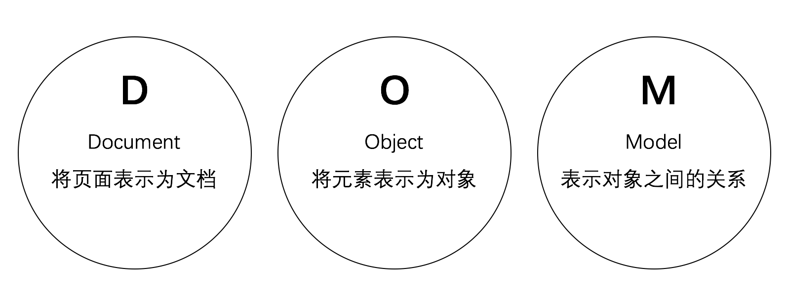

## DOM 是什么

DOM 被设计用于解析 HTML 页面文档，方便 JavaScript 语言通过 DOM 访问和操作 HTML 页面中的内容。

DOM 是由 W3C 组织定义标准规范，并且由各大浏览器厂商支持。严格意义上来讲，DOM 并非属于 JavaScript 语言。

> 在其他开发语言中，也支持 DOM 的标准规范，例如 PHP 语言。

我们之所以可以在 JavaScript 语言中使用 DOM，是因为各大浏览器将 DOM 的标准规范内容封装成了 JavaScript 语言所支持的形式。

对于 DOM 中的对象，我们只有调用的权限，没有修改的权限，也说明了这个问题。

### DOM 的具体含义是什么

DOM 其实是个缩写，全称是 **Document Object Model**，被译为 **文档对象模型**。



其中 **D** 表示 **Document**，就是 DOM 将 HTML 页面解析为一个 **文档**。同时提供了 `document` 对象。

其次 **O** 表示 **Object**，就是 DOM 将 HTML 页面中每个元素解析为一个 **对象**。例如 `<body>` 元素在 DOM 中对应就是 `HTMLBodyElement` 对象。

最后 **M** 表示 **Model**，就是 DOM 中表示各个对象之间的关系。

> **模型（Model）**主要是指 DOM 树结构。

### DOM 是如何解析 HTML 页面的呢

浏览器加载并运行 HTML 页面后，会创建 DOM 结构。由于 DOM 中的内容被封装成了 JavaScript 语言中的对象，所以我们可以使用 JavaScript 语言通过 DOM 结构来访问和操作 HTML 页面中的内容。

换句话讲，DOM 可以理解为是 HTML 页面与 JavaScript 语言之间的一个桥梁。


## DOM 的定义

由于 DOM 的标准规范是由 W3C 组织起草并定义的，所以 W3C 对 DOM 的定义是目前最权威的解释。

下面这段英文描述，就是 W3C 对 DOM 的定义原文:

> The Document Object Model is a platform- and language-neutral interface that will allow programs and scripts to dynamically access and update the content, structure and style of documents. The document can be further processed and the results of that processing can be incorporated back into the presented page.

下面这段是本人的翻译（仅供参考）:

> DOM 是一个独立于任何语言和平台的接口，允许任何语言或脚本动态地访问和更新 HTML 文档的内容、结构和样式。该 HTML 页面可以进一步处理，并且该处理的结果可以被合并到所呈现的 HTML 页面中。

### DOM 标准是独立的

通过 W3C 的定义，我们可以知道 DOM 是不属于任何开发语言的。当然，DOM 也不会属于 JavaScript 语言。

任何一个开发语言，只要支持了 DOM 的标准规范，都可以通过 DOM 访问和操作 HTML 页面。

换句话讲，DOM 在不同开发语言中，有着不同的使用形式。但最核心的标准规范都是一样的，只是具体使用的开发语言的语法不同而已。

比如下面这段代码，就是 JavaScript 中的 DOM 内容:

```javascript
var btn = document.getElementById('btn');
var className = btn.className;
className += ' animate';
btn.className = className;
```

### DOM 的作用

通过 W3C 的定义，我们还可以知道 DOM 主要是用来解析 HTML 页面的。也就是只要支持 DOM 的标准规范的开发语言，都可以通过 DOM 访问和更新 HTML 页面的内容、结构和样式。

> 早期的 DOM 除了可以访问和更新 HTML 页面外，还可以访问和更新 XML 文档。但目前 XML 文档的使用场景越来越少，再加上 Web 前端开发需求越来越多。导致 DOM 主要用来访问和更新 HTML 页面了。

## 浏览器的支持

目前几乎所有的浏览器都支持 DOM 的内容。但是不是支持的是 W3C 对 DOM 的标准规范呢？

### 浏览器和 W3C 谁更早

浏览器对 DOM 的支持远早于 W3C 定义 DOM 的标准规范。也就是说，在 W3C 定义 DOM 的标准规范之前，各大浏览器就支持了 DOM。

最早，是 Navigator 浏览器支持 DOM。但只是提供了 `Document` 对象的一些属性和方法。

后期，IE 浏览器也加入了对 DOM 的支持。但 IE 浏览器与 Navigator 浏览器所支持的 DOM 是有区别的。

> 这也是 DOM 在不同浏览器中的兼容问题。

而 W3C 组织定义 DOM 的标准规范，主要也是为了解决 DOM 在不同浏览器的差异问题。

虽然，自从 W3C 定义了 DOM 的标准规范后，浏览器的兼容问题好了很多。但，各大浏览器都或多或少地扩展了 W3C 定义的 DOM 标准。

> 在实际开发中，尽量使用 W3C 的 DOM 标准规范，以避免更多的浏览器兼容问题。

---
本教程免费开源，任何人都可以免费学习、分享，甚至可以进行修改。但需要注明作者及来源，并且不能用于商业。

本教程采用[知识共享署名-非商业性使用-禁止演绎 4.0 国际许可协议](http://creativecommons.org/licenses/by-nc-nd/4.0/)进行许可。