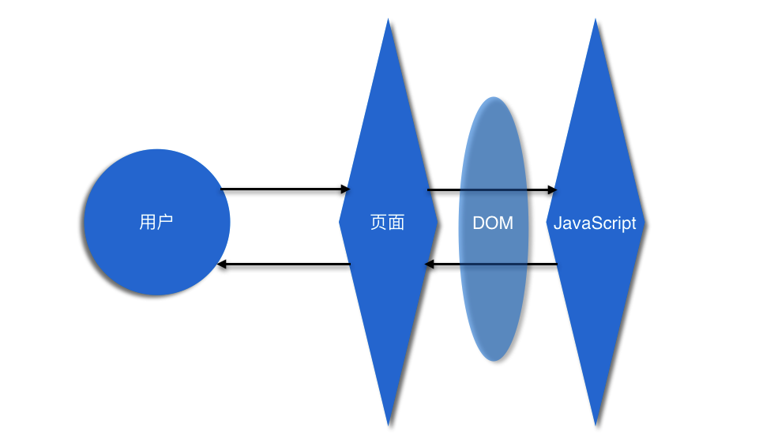
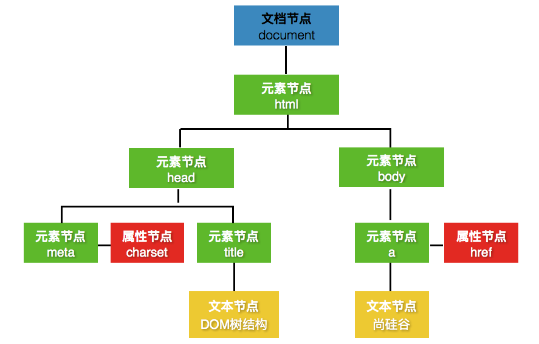
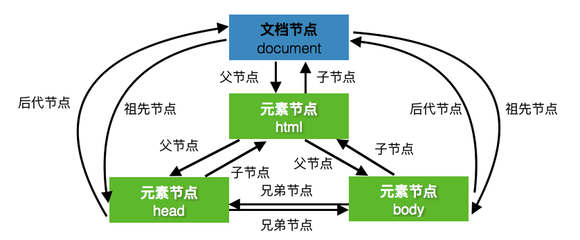
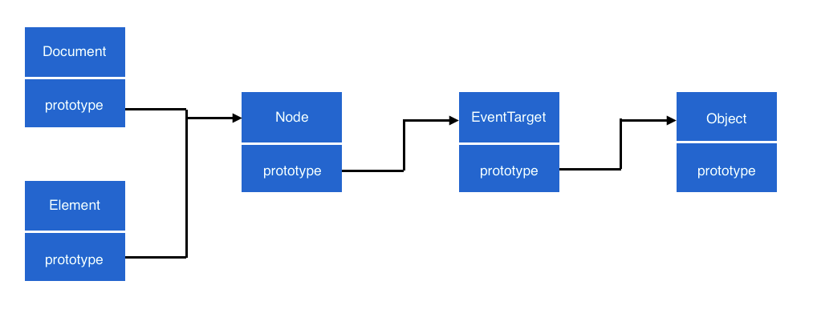

# DOM 是个啥

> **导读:** 你将学习 DOM 是什么，DOM 的作用是什么，以及 DOM 节点树是什么等内容。

## 从名字说起

DOM 全称叫做 **Document Object Model**，译为 **文档对象模型**。在 JavaScript 中主要依靠 DOM 操作 HTML 页面的内容。

简单来说，DOM 就是定制了一套解析和操作 HTML 页面的规则。这和我们在现实生活中的方式没有什么区别。

> **注:** DOM 可以解析 HTML 和 XML 两种文档，但目前前端领域以 HTML 页面为主。所以，这里我们并不讨论有关 XML 的内容。

比如，我们使用"房子"、"车子"或"票子"等这些名词来形容现实生活中存在的事物。当我们使用这些名词与别人交流时，相信对方也可以很明白我们说的是什么。因为我们对现实生活中的事物有着相同的解析规则。

对比现实生活，我们对 HTML 页面中的内容也是一样。我们定制了一套大家共识的规则，比如"元素"、"节点"或"属性"等这些名词来形容 HTML 页面中的内容。

我们学习 DOM 操作，实际上就是学习 DOM 定制的这套规则和涉及的概念而已。

> **以下是 W3C 组织对 DOM 的定义:**
> 
> The Document Object Model is a platform- and language-neutral interface that will allow programs and scripts to dynamically access and update the content, structure and style of documents. The document can be further processed and the results of that processing can be incorporated back into the presented page.
> 
> 以下是笔者提供的翻译:
> 
> DOM 是一个独立于任何语言和平台的接口，允许任何语言或脚本动态地访问和更新 HTML 文档的内容、结构和样式。该 HTML 页面可以进一步处理，并且该处理的结果可以被合并到所呈现的 HTML 页面中。

## DOM 的角色

在前端领域中，DOM 到底作为一个什么样的角色存在，起着什么样的作用呢？

最初的前端职位主要是处理有关 HTML 页面的内容，这包含了 HTML 的元素和 CSS 的样式等。而 JavaScript 就是通过 DOM 操作 HTML 页面的元素和 CSS 的样式的。



JavaScript 通过 DOM 既可以获取 HTML 页面的元素或者 CSS 的样式内容，也可以操作 HTML 页面的元素或者 CSS 的样式内容。

简而言之，DOM 就是将 HTML 页面和 JavaScript 语言连接起来。

> **以下是 W3C 解释为什么需要 DOM:**
> 
> "Dynamic HTML" is a term used by some vendors to describe the combination of HTML, style sheets and scripts that allows documents to be animated. The W3C has received several submissions from members companies on the way in which the object model of HTML documents should be exposed to scripts. These submissions do not propose any new HTML tags or style sheet technology.
> 
> 以下是笔者提供的翻译:
> 
> DHTML（动态的 HTML）是一些厂商为了宣传所使用的术语，用来描述 HTML、CSS 和 JavaScript 的组合，允许 HTML 文档实现动态化。W3C 已经收到一些成员公司提交的关于 HTML 文档的对象模型应该暴露在 JavaScript 中的方法。这些建议中没有建议任何新的 HTML 标签或样式技术。W3C 正在努力确保动态交互和脚本语言的解决方案是一致的。

## DOM 的规则

DOM 的规则就是 HTML 页面解析为一个由节点和对象组成的结构。

### DOM 树结构

DOM 将 HTML 页面表示为一个树形结构，方便访问和操作 HTML 页面中的内容。具体如何表示，我们可以通过以下示例进行理解。

这是一个简单的 HTML 页面的源代码:

```html

<!DOCTYPE html>
<html>
	<head>
		<meta charset="UTF-8">
		<title>DOM树结构</title>
	</head>
	<body>
		<a href="www.example.com">示例</a>
	</body>
</html>
```

DOM 可以将上面的 HTML 页面表示为一个树形结构，如下图所示:


### DOM 中的节点

节点（Node）原本的意思是表示网络中的连接点，是个网络术语。而在 DOM 树结构中，节点是构成树形结构的连接点。

DOM 树结构中主要由以下 4 种节点组成:

| 节点类型 | 描述 |
| :---: | --- |
| 文档节点 | 表示整个 HTML 页面（相当于 document 对象）。当需要访问任何标签、属性或文本时，都可以通过文档节点进行导航。|
| 元素节点 | 表示 HTML 页面中的标签（即 HTML 页面的结构）。当访问 DOM 树时，需要从查找元素节点（标签）开始。|
| 文本节点 | 表示 HTML 页面中的标签所包含的文本内容。|
| 属性节点 | 表示 HTML 页面中的开始标签包含的属性。|

> 更多有关节点类型的请参考: [节点类型文档](node-types.md)

根据节点的分类，上面的 DOM 树结构就可以更详细的表示为如下示例:



### 节点之间的关系

DOM 节点树的概念从上面的图示中可以一目了然。构成节点树结构的同时，节点与节点之间也存在着如下 3 种关系:

- 祖先节点与后代节点的关系
- 父节点与子节点的关系
- 兄弟节点的关系



## 面向对象的

DOM 是完全的面向对象地描述 HTML 页面。简单理解，就是 DOM 中提供一系列 JavaScript 对象。

其中最核心的三个对象是:

- Document 对象
- Node 对象
- Element 对象

通过以下代码的测试，可以让我们了解这三个对象的继承关系:

```javascript
console.log(Document.prototype instanceof Node);
console.log(Element.prototype instanceof Node);
console.log(Node.prototype instanceof EventTarget);
    
console.log(EventTarget.prototype instanceof Object);
```

具体的继承关系，我们也可以通过以下示例进行理解:



**[下一回](../02-dom-and-js/README.md)**