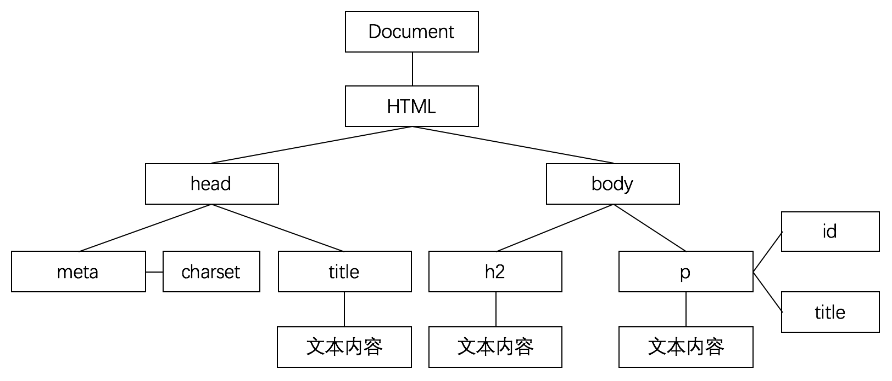
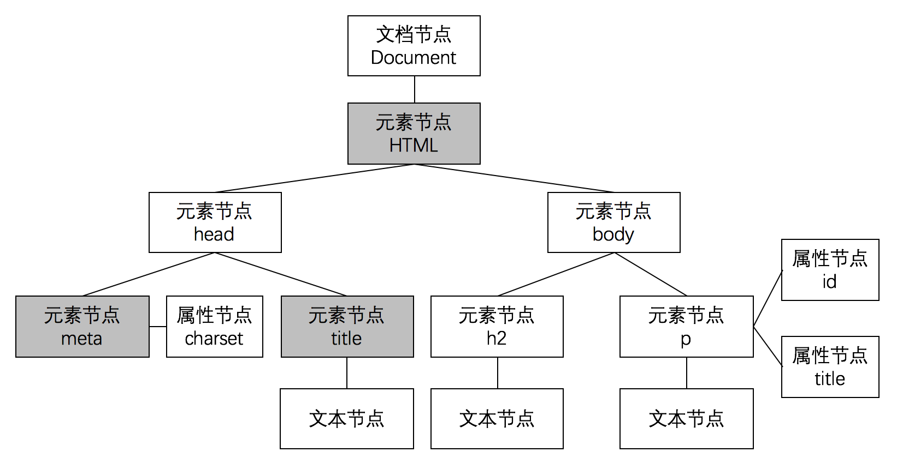

## DOM 树结构

DOM 之所以可以访问和更新 HTML 页面中的内容、结构和样式，是因为 DOM 将 HTML 页面解析为一个 **树结构**。

例如下面这段代码是一个简单的 HTML 页面源代码:

```html
<!DOCTYPE html>
<html lang="en">
<head>
    <meta charset="UTF-8">
    <title>示例页面</title>
</head>
<body>
<h2>这是一个示例页面</h2>
<p id="p" title="this is p.">这是一个段落内容.</p>
</body>
</html>
```

将上面的 HTML 页面绘制成 DOM 树结构，如下效果:



通过上面的 DOM 树结构，我们可以看到，`Document` 对象是作为 DOM 树结构的入口。再根据 DOM 树结构的特点，我们就可以定位到 HTML 页面中任意一个元素、属性或文本内容。

浏览器加载并运行 HTML 页面时，会创建 DOM 树结构这个模型。并且 DOM 树结构模型会被存储在浏览器的内存中。

> 当 HTML 页面内容过于庞大和复杂时，生成的 DOM 树结构就越复杂。进而，浏览器加载 HTML 页面的耗时就越长。

## 什么是节点

节点（Node）原本是网络术语，表示网络中的连接点。一个网络是由一些节点构成的集合。

在 DOM 树结构中，节点也是很重要的一个概念。简单来说，节点作为 DOM 树结构中的连接点，最终构成了完整的 DOM 树结构。

### DOM 树结构中的节点

在 DOM 树结构中，主要由以下 4 种节点组成:

| 节点名称 | 含义 | 描述 |
| --- | --- | --- |
| 文档节点 | 表示整个 HTML 页面（相当于 document 对象）| 当需要访问任何标签、属性或文本时，都可以通过文档节点进行导航 |
| 元素节点 | 表示 HTML 页面中的标签（即 HTML 页面的结构）| 当访问 DOM 树时，需要从查找元素节点开始 |
| 属性节点 | 表示 HTML 页面中的开始标签包含的属性 | |
| 文本节点 | 表示 HTML 页面中的标签所包含的文本内容 | |

> 除了上面 4 种常见的节点类型以外，DOM 树结构中还具有很多节点类型。


> 还有一些节点类型，目前已被废弃（不再使用）。


## DOM 节点树结构

通过**节点**概念，我们可以将原本的 DOM 树结构改成 DOM 节点树结构进行表示。


在 DOM 的标准规范中，提供了 `Node` 对象。该对象主要依靠 DOM 节点树结构中的常见 4 种节点类型，来访问和更新 HTML 页面中的内容。

> 关于 `Node` 对象，我们会在后面的章节中学习。

## 节点之间的关系

DOM 中的 **M** 表示 **Model（模型）**，也可以用来表示 DOM 节点树结构中节点之间的关系。

在 DOM 节点树结构中，主要具有以下三层关系。

### 父级与子级

如果我们将 HTML 页面中某一个元素作为父级的话，那包含在该元素内的第一层所有元素都可以称为该元素的子级。

例如，我们来看一下下面这个 DOM 节点树结构:



在上面的 DOM 节点树结构中，`<html>` 元素作为父级，`<head>` 和 `<body>` 元素作为子级。

### 祖先与后代

如果我们将 HTML 页面中某一个元素作为祖先的话，那包含在该元素内的所有元素（除子级之外的）都可以称为该元素的后代。

例如，我们来看一下下面这个 DOM 节点树结构:


在上面的 DOM 节点树结构中，`<html>` 元素作为祖先，`<meta>`、`<title>`、`<h2>` 和 `<p>` 元素作为后代。

### 兄弟关系

具有相同父级元素的两个或几个元素之间就是兄弟关系。例如，我们来看一下下面这个 DOM 节点树结构:


在上面的 DOM 节点树结构中，`<meta>` 和 `<title>` 元素就是兄弟关系。因为它们具有相同的父级元素 `<head>`。

> **值得注意的是:** `<title>` 和 `<h2>` 元素并不是兄弟关系。因为它们的父级元素并不是相同元素。

DOM 访问和更新 HTML 页面中的内容，主要依靠 DOM 节点树结构中这三种节点关系完成。

---
本教程免费开源，任何人都可以免费学习、分享，甚至可以进行修改。但需要注明作者及来源，并且不能用于商业。

本教程采用[知识共享署名-非商业性使用-禁止演绎 4.0 国际许可协议](http://creativecommons.org/licenses/by-nc-nd/4.0/)进行许可。