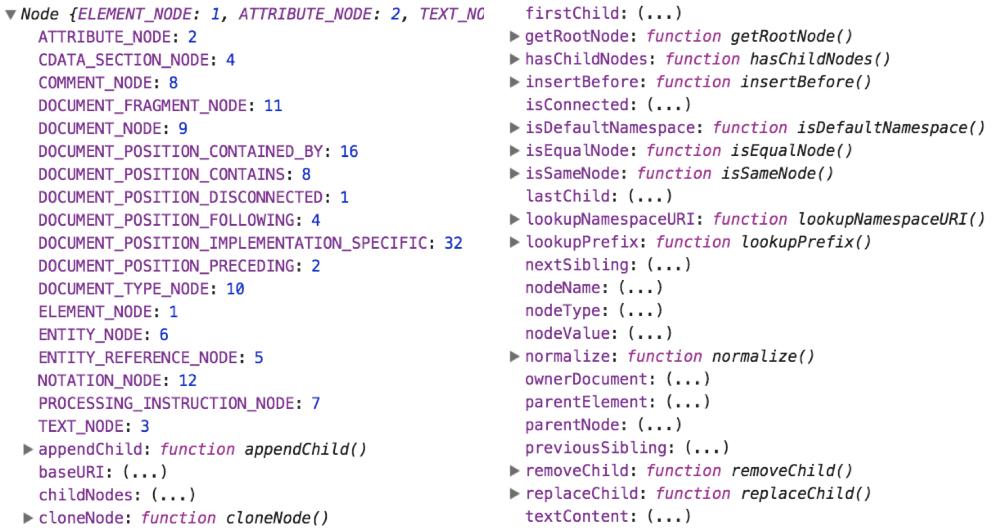

DOM 的标准规范中提供了 Node 对象，该对象主要提供了用于解析 DOM 节点树结构的属性和方法。

## Node 对象的作用

DOM 树结构主要是依靠节点进行解析，称为 DOM 节点树结构。Node 对象是解析 DOM 节点树结构的主要入口。

Node 对象提供的属性和方法，可以实现遍历节点、插入节点和替换节点等操作。而这些操作也正是我们学习 Node 对象最为主要的目的。

## Node 对象的继承链关系

Node 对象是继承于 EventTarget 对象的，EventTarget 是一个用于接收事件的对象。我们可以通过如下代码测试两者之间的继承关系:

```javascript
console.log(Node.prototype instanceof EventTarget);
```

DOM 的标准规范中的 Document 对象和 Element 对象（后面的章节要学习的内容）都是继承于 Node 对象的。我们可以通过如下代码测试它们之间的继承关系:

```javascript
console.log(Document.prototype instanceof Node);
console.log(Element.prototype instanceof Node);
```

## 测试 Node 对象

由于 Node 对象是 DOM 底层封装的对象，所以我们并不能通过直接打印 Node 对象来查看其属性或方法。

而是要通过打印 Node 对象的 prototype 原型属性来查看其属性或方法。

```javascript
console.log(Node.prototype)
```

运行 HTML 页面后，打开 **开发者工具**，我们可以看到以下内容:


