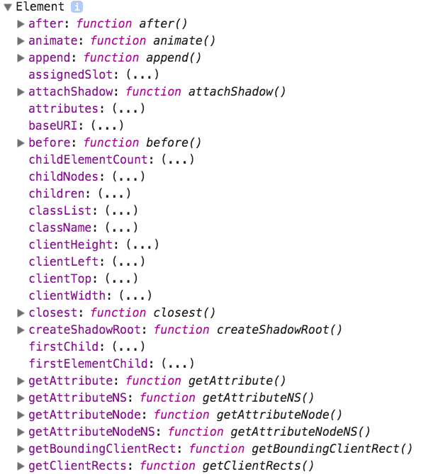

DOM 的标准规范中提供了 Element 对象，该对象提供了 HTML 页面中所有元素所具有的属性和方法。

我们都知道 DOM 标准规范中提供了 Node 对象，主要是依靠 DOM 节点树结构访问和更新 HTML 页面的内容。而 DOM 标准规范中提供了 Element 对象，主要是依靠 DOM 元素树结构访问和更新 HTML 页面的内容。

> **值得注意的是:** 所有的 HTML 页面的元素都是 HTMLElement 对象，而这个对象又是继承于 Element 对象的。

## Element 对象的作用

HTML 页面中的标签，既是元素节点，又是元素。

如果我们将 HTML 页面中的标签当做元素节点的话，就是利用 DOM 节点树结构进行解析和操作。但是，有些情况利用 Node 对象实现比较复杂，例如属性节点的操作，而使用 Element 对象提供的属性和方法相对会简单一些。

我们可以简单地理解 Element 对象是 Node 对象的补充。当然，这种理解并不准确！

通过 Element 对象，我们可以实现遍历元素、属性操作等操作。而这些操作也正是我们要学习 Element 对象的属性和方法。

## 测试 Element 对象

由于 Element 对象是 DOM 底层封装的对象，所以我们并不能通过直接打印 Element 对象来查看其属性或方法。
而是要通过打印 Element 对象的 prototype 原型属性来查看其属性或方法。

```javascript
console.log(Element.prototype)
```

运行 HTML 页面后，打开 **开发者工具**，我们可以看到以下内容:



> 上面运行后的结果只是部分内容，并不是全部内容。请自行测试！