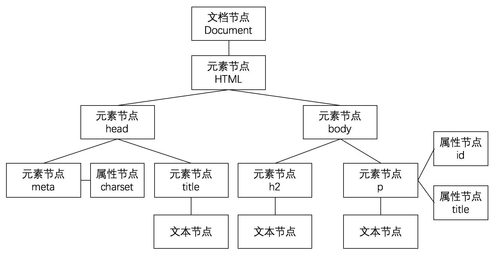
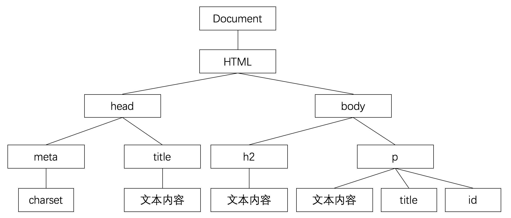
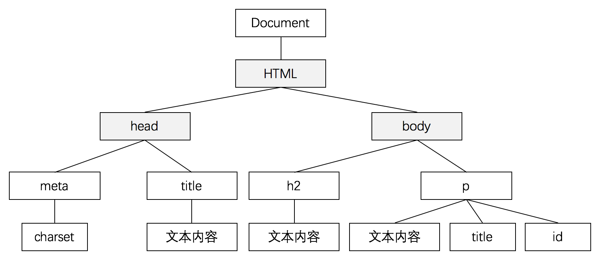
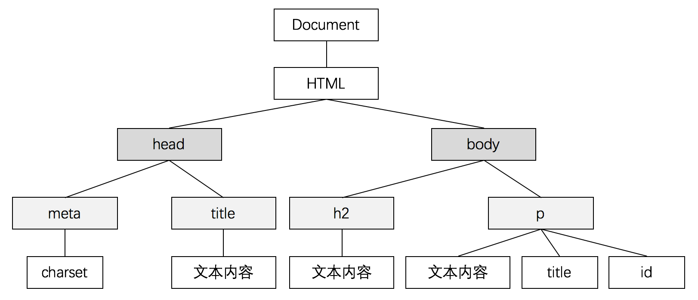
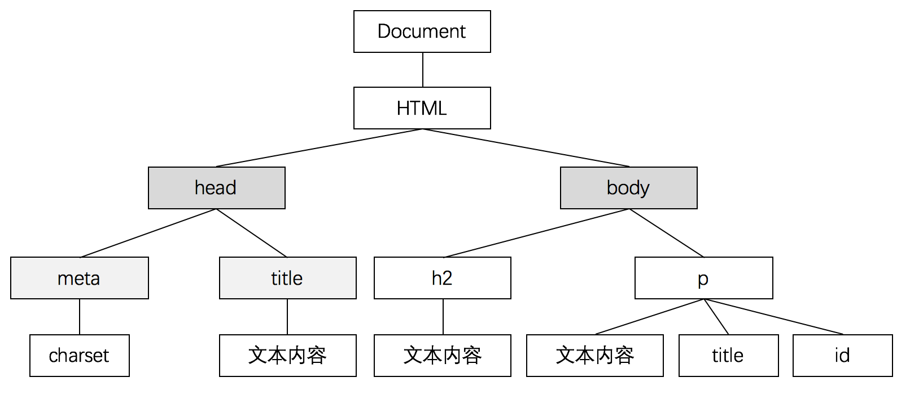

DOM 元素树结构与 DOM 节点树结构很相似，区别仅在于是利用节点解析 HTML 元素，还是利用元素解析 HTML 元素。

## DOM 树结构

还记得下面这张图吗?


上图中的 HTML 页面源代码如下:

```html
<!DOCTYPE html>
<html lang="en">
<head>
    <meta charset="UTF-8">
    <title>示例页面</title>
</head>
<body>
<h2>这是一个示例页面</h2>
<p id="p" title="this is p.">这是一个段落内容.</p>
</body>
</html>
```

DOM 之所以可以访问和更新 HTML 页面中的内容、结构和样式，是因为 DOM 将 HTML 页面解析为一个 **树结构**。

## DOM 元素树

上述 HTML 页面示例代码，如果利用节点方式解析为 **DOM 节点树结构** 的话，如下所示:



如果利用元素方式解析为 **DOM 元素树结构** 的话，如下所示:



通过上图所示，我们发现 DOM 元素树结构与 DOM 节点树结构类似，同样在元素之间存在着某些固定的关系。

## 元素之间的关系

在 DOM 元素树结构中，主要具有以下三层关系。

### 父级与子级

如果我们将 HTML 页面中某一个元素作为父级的话，那包含在该元素内的第一层所有元素都可以称为该元素的子级。

例如，我们来看一下下面这个 DOM 元素树结构:



在上面的 DOM 节点树结构中，`<html>` 元素作为父级，`<head>` 和 `<body>` 元素作为子级。

### 祖先与后代

如果我们将 HTML 页面中某一个元素作为祖先的话，那包含在该元素内的所有元素（除子级之外的）都可以称为该元素的后代。

例如，我们来看一下下面这个 DOM 元素树结构:



在上面的 DOM 节点树结构中，`<html>` 元素作为祖先，`<meta>`、`<title>`、`<h2>` 和 `<p>` 元素作为后代。

### 兄弟关系

具有相同父级元素的两个或几个元素之间就是兄弟关系。例如，我们来看一下下面这个 DOM 元素树结构:



在上面的 DOM 元素树结构中，`<meta>` 和 `<title>` 元素就是兄弟关系。因为它们具有相同的父级元素 `<head>`。

## 节点与元素的区别

利用节点解析 DOM 节点树结构时，我们会发现元素节点、属性节点和文本节点是独立存在的。

如果获取文本节点的话，文本节点是元素节点的子节点。所以，我们可以通过子节点方式得到指定的文本节点。

如果获取属性节点的话，由于属性节点不是元素节点的子节点。所以，并不能直接通过获取子节点的方式得到指定的属性节点。

而利用元素解析 DOM 元素树结构时，我们会发现元素、属性和文本是从属关系。什么意思呢? 我们可以简单地将属性和文本内容理解为是元素的一部分。

这样，我们获取属性或文本内容时，就可以通过元素的获取属性或获取文本内容的方法或属性来实现。

关于节点与元素的区别，我们可以通过以下示例代码来理解:

```javascript
// 节点方式获取属性节点
var btn = document.getElementById('btn');
var attrNode = btn.getAttributeNode('class');
var attrValue = attrNode.nodeValue;
// 元素方式获取属性
var btn = document.getElementById('btn');
var attrValue = btn.getAttribute('class');
```