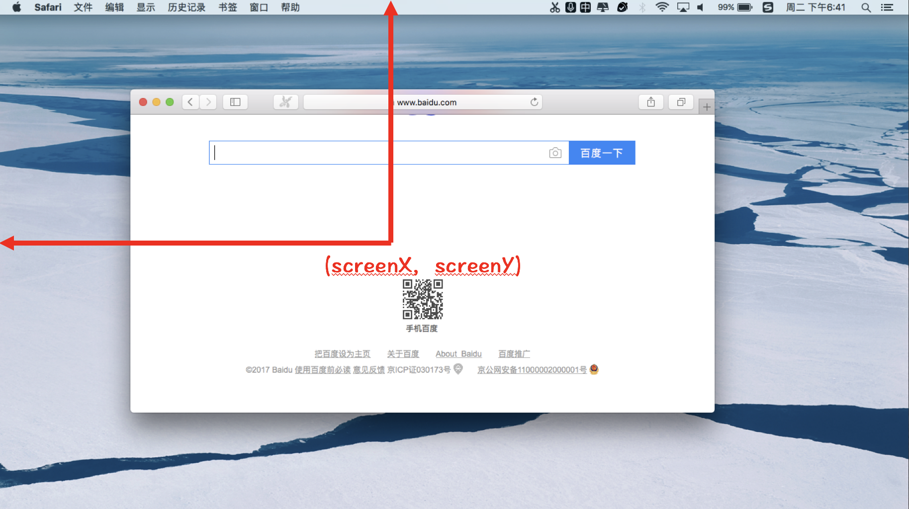

# 获取鼠标坐标

Event 事件对象提供了触发注册事件时，有关鼠标的坐标值相关属性:

- pageX 和 pageY: 表示鼠标在整个页面中的位置。如果页面过大（存在滚动条），部分页面可能存在可视区域之外。
- clientX 和 clientY: 表示鼠标在整个可视区域中的位置。
- screenX 和 screenY: 表示鼠标在整个屏幕中的位置。从屏幕（不是浏览器）的左上角开始计算。
- offsetX 和 offsetY: 表示鼠标相对于定位父元素的位置。

## 鼠标相对页面的坐标

pageX 和 pageY 属性表示鼠标相对于页面的坐标值，我们可以通过以下示意图更好地理解:

> **值得注意的是:** 部分页面可能会在浏览器可视窗口的外面。如果部分页面存在可视窗口外面的话，相对于页面的坐标值会大于相对于可视窗口的坐标值。

## 鼠标相对可视窗口的坐标

clientX 和 clientY 属性表示相对于可视窗口的坐标值，我们可以通过以下示意图更好地理解:

> **值得注意的是:** clientX 和 clientY 表示鼠标相对于浏览器可视窗口的坐标，是不包含浏览器的地址栏、工具栏等区域的。

## 鼠标相对屏幕的坐标

screenX 和 screenY 属性表示相对于电脑屏幕的坐标值，我们可以通过以下示意图更好地理解:

## 鼠标相对目标元素的坐标

offsetX 和 offsetY 属性表示相对于目标元素的坐标值，我们可以通过以下示意图更好地理解:

offsetX 和 offsetY 表示鼠标相对于目标元素的偏移量。这里的目标元素指的是触发注册事件的元素。
