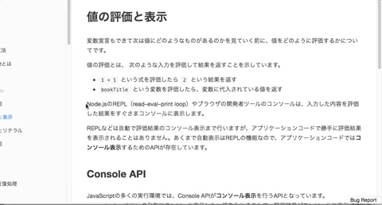

> **学习本套课程，需要你具备 HTML、CSS 以及 JavaScript 语法部分的基础。**

## 前言

本套课程共分为 8 个章节，从基础的概念到具体的用法，一一详细的进行阐述。只为努力作为学习 DOM 技术的最好的自学课程。

> **本套课程会一直更新，直到达到适合于所有人自学为止。**

8 个章节内容，大体上可以被分为以下几个部分内容:

> **说明:** 如果你已经掌握 DOM 中的部分内容，可以根据自己的情况选择性的进行学习。

### 第一部分: 概念

我们首先从第一章节概念入手，先掌握什么是 DOM，以及 DOM 中非常重要的概念 DOM 树结构。

这部分内容，是你学习 DOM 中后续内容的基础。概念清晰了，操作才会更顺手。学习概念，不仅仅只是单纯地阅读文字这么简单。要试着用自己的话来描述你所学习的概念，并把它发布到网络上，让别人替你检查，你的理解是否准确。

> 如果你不知道如何发布到网络上，可以加入底部的 QQ 讨论群，与其他人共同学习。

### 第二部分: 核心对象

DOM 解析 HTML 页面，最主要的是依靠 Document、Node 和 Element 这三个核心对象完成的。所以，第二章、第三章和第四章是分别学习这三个核心对象。

这部分内容，作者在编写的过程中，尽量按照 W3C DOM 的规范标准进行编写。可能，学习掌握起来有一些难度。

不过，不要灰心! 作者会在后续的更新中，加入大量适当的案例，帮助你更好地掌握这部分内容。

> 你可以 **star** 或者 **watch** 本课程，这样一旦有更新，GitHub 会通知你。

### 第三部分: 样式操作

DOM 解析 HTML 页面，其中很大部分是对 CSS 样式的操作。如今的 HTML 页面显示的效果越加复杂，主要都是由 CSS 样式完成的。

所以，掌握如何获取和设置 CSS 样式也就显得很重要了。但是，技术知识和实际操作还是会存在一些差异，这些差异作者也会在后续的案例更新中进行补充。

> 你可以 **star** 或者 **watch** 本课程，这样一旦有更新，GitHub 会通知你。

### 第四部分: 事件

事件，目前作为 DOM 操作中很主要的组成部分，也是你学习 DOM 技术必须要掌握的技术知识。所以，作者在第六章节，利用了大量篇幅来阐述有关事件的内容。

> **说明:** 目前课程中有关事件一章，并没有罗列出所有事件的用法和应用场景。

### 第五部分: 表单

表单，本身就是作为 HTML 页面技术中很重要的一个组成部分。而 DOM 操作表单也就变得重要了。

目前，大部分初学者都可以简单地掌握 DOM 操作表单的方式。但，很难全面系统地掌握，而很多容易忽视的内容，往往都是开发中比较常用的。

### 第六部分: BOM

BOM，原本是作为 JavaScript 三个组成部分的其中一个，但由于篇幅较少，作者将其纳入到 DOM 课程之中。

## 反馈

本套课程会尽量完善，编写过程中难免出现纰漏。你可以通过以下展示方式进行反馈，作者会根据反馈及时更新和修改。

## 交流

你可以扫描下方的二维码，加入本套课程的 QQ 讨论群，与其他童鞋一起学习交流。

## 版权

本套课程的文本内容免费开源，任何人都可以免费学习、分享，甚至可以进行修改。但需要注明作者及来源，并且不能用于商业。

本套课程采用<a rel="license" href="http://creativecommons.org/licenses/by-nc-nd/4.0/">知识共享署名-非商业性使用-禁止演绎 4.0 国际许可协议</a>进行许可。

 