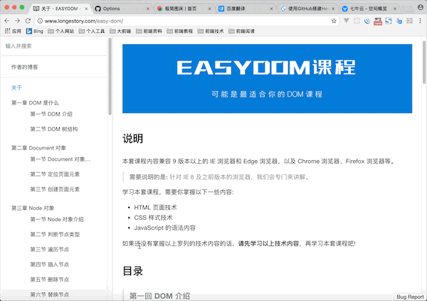

## 说明

本套课程内容兼容 9 版本以上的 IE 浏览器和 Edge 浏览器，以及 Chrome 浏览器、Firefox 浏览器等。

> **需要说明的是:** 针对 IE 8 及之前版本的浏览器，我们会专门来讲解。

学习本套课程，需要你掌握以下一些内容:

- HTML 页面技术
- CSS 样式技术
- JavaScript 的语法内容

如果还没有掌握以上罗列的技术内容的话，**请先学习以上技术内容**，再学习本套课程吧!

## 反馈

## 目录

> #### 第一回 DOM 介绍

在最开始，我们先来了解 DOM 是什么、DOM 的作用，以及浏览器的支持是怎么样的。

> #### 第二回 DOM 树结构

现在我们知道了 DOM 是什么，再让我们了解一下 DOM 树结构、节点是什么，以及节点在 DOM 树结构中的关系。

> #### 第三回 Document 对象介绍

在这个系列的前两篇，我们掌握了 DOM 中非常重要的概念。接下来我们将学习 DOM 中核心对象之一的 Document 对象。

> #### 第四回 定位页面元素

在对 Document 对象有了基本了解之后，我们将学习 Document 对象中很重要的功能 - 就是如何定位页面元素。

> #### 第五回 创建页面元素

Document 对象除了提供了定位页面元素的功能之外，还提供了如何创建页面元素。也是这一回我们将学习的内容。

> #### 第六回 Node 对象介绍

到此，我们已经掌握了 Document 对象在 DOM 中的功能。接下来，我们将继续学习 DOM 中核心对象之一的 Node 对象。

> #### 第七回 判断节点类型

DOM 节点树结构中，有常见的四种节点类型，我们经常需要先区分再操作。这一回中，我们将学习如何判断节点的类型。

> #### 第八回 遍历节点

通过 DOM 访问 HTML 页面主要依靠 DOM 节点树结构，具体操作则依靠节点之间的关系。而本回中，我们就是学习如何利用节点之间的关系实现遍历节点。

> #### 第九回 插入节点

在前几回中，我们掌握了通过 Node 对象如何访问 HTML 页面。在这一回中，我们将学习如何向 HTML 页面添加节点。

> #### 第十回 删除节点

Node 对象除了提供了如何向 HTML 页面添加节点的功能，还提供了如何从 HTML 页面中删除节点。

> #### 第十一回 替换节点

在这一回中，我们继续学习 Node 对象提供的实现将新节点替换 HTML 页面中现有的节点的功能。

> #### 第十二回 复制节点

Node 对象提供的常见节点操作中，我们将学习如何实现复制（克隆）节点的功能。

> #### 第十三回 textContent 属性

关于 Node 对象提供的属性和方法中，最后我们还要再学习其 textContent 属性，实现获取或设置指定节点的文本内容。

> #### 第十四回 Element 介绍

如果你已经看到了这里，说明你已经掌握了 DOM 标准规范中的两个核心对象 Document 和 Node 对象。接下来，我们将继续学习 DOM 中核心对象之一的 Element 对象。

> #### 第十五回 DOM 元素树

在基于 DOM 树结构，我们已经掌握了什么是 DOM 节点树结构，以及节点之间的关系。在学习 Element 对象的具体用法之前，我们先来了解一下什么是元素树，以及元素之间的关系。

> #### 第十六回 定位页面元素

Document 对象的主要应用之一就是定位 HTML 页面中的元素，而 Element 对象同样提供了类似的方法用于定位 HTML 页面中指定元素内的元素。

> #### 第十七回 遍历元素

Node 对象提供的属性或方法实现了遍历节点，但实际操作中，会有空白节点问题。通过 Element 对象提供的属性或方法实现遍历元素。

> #### 第十八回 属性操作

Element 对象相对于 Node 对象更便捷地就是对属性的操作。

> #### 第十九回 innerHTML 属性

有关 Element 对象提供的属性和方法，在最后我们还需要学习一个特殊的属性，就是 innerHTML 属性。

> #### 第二十回 获取内联样式

HTML 页面定义样式分为内联样式和外联样式。DOM 操作 CSS 样式表，首先学习如何操作内联样式。

> #### 第二十一回 获取外联样式

DOM 的规范标准中，也提供了如何操作外联样式。只是操作比较复杂，加之实际操作有其他方式替代，故少有人了解。

> #### 第二十二回 获取 class 属性

DOM 中提供的 class 相关属性是操作样式的一种常见手段。

> #### 第二十三回 获取当前有效样式

获取当前有效样式，并非 DOM 中有关样式的内容。但在实际开发中，经常使用。

> #### 第二十四回 设置内联样式

内联样式的操作，可以分为获取和设置。设置内联样式的操作更为重要。

> #### 第二十五回 设置 class 属性

DOM 提供的 class 相关属性无论是获取，还是操作都是同等的重要。

> #### 第二十六回 Element 对象的样式属性

Element 对象也提供了一些有关样式获取的方式，这些方式简化了样式的获取。

> #### 第二十七回 什么是事件

事件，是 DOM 中完成页面与用户之间的交互。页面的动态效果中，事件起了很大的作用。事件也是 DOM 中的一个重要组成部分。

> #### 第二十八回 注册事件

这里我们详细地阐述了三种注册事件的方式，也对比了它们之间的区别。

> #### 第二十九回 移除注册事件

移除注册事件虽不常用，但也是掌握的一个重要部分。

> #### 第三十回 Event 事件对象

Event 事件对象在事件处理过程中，起着很大的作用。事件处理中很多功能都是通过 Event 事件对象完成的。

> #### 第三十一回 获取目标元素

获取目标元素的方式，主要就是通过 Event 事件对象的属性完成。但，也有其他方式。

> #### 第三十二回 阻止默认行为

阻止默认行为，是实际开发中非常常用的功能。实现方式也具有多种方式。

> #### 第三十三回 获取鼠标坐标

鼠标的坐标值，是很多实现动态效果的基础。这部分内容主要是与鼠标之间的交互效果的实现。

> #### 第三十四回 事件流

事件流，详细地阐述了事件的传播流程。掌握这部分知识，有效地帮助我们更好地理解事件。

> #### 第三十五回 事件委托

事件委托，并不是一个技术知识点，而是实际开发中总结的经验。可以有效地简化实现的代码逻辑。

## 版权

本套课程的文本内容免费开源，任何人都可以免费学习、分享，甚至可以进行修改。但需要注明作者及来源，并且不能用于商业。

本套课程采用<a rel="license" href="http://creativecommons.org/licenses/by-nc-nd/4.0/">知识共享署名-非商业性使用-禁止演绎 4.0 国际许可协议</a>进行许可。

 