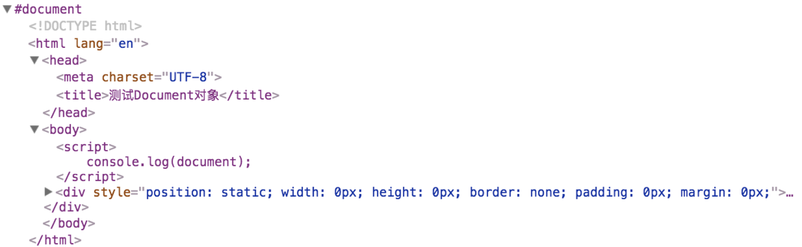

Document 对象是 DOM 的标准规范中比较重要的对象之一。该对象提供了访问和更新 HTML 页面内容的属性和方法。

## Document 对象的作用

Document 对象作为 DOM 访问和更新 HTML 页面内容的入口。简单来说，我们可以把 Document 对象理解为在 DOM 的标准规范中代表 HTML 页面。（**当然，这种说法并不准确**）

Document 对象提供的属性和方法，可以实现定位 HTML 页面中的元素，或者创建新的元素等功能。

## 测试 Document 对象

我们可以通过 `console.log` 方法将 Document 对象打印，测试 Document 对象中提供了哪些属性和方法:

```javascript
console.log(document);
```

运行 HTML 页面后，打开 **开发者工具**，我们可以看到以下内容:



我们会发现 `console` 会将 HTML 页面的源代码打印出来。这个结果充分地说明了 Document 对象在 DOM 的标准规范中代表整个 HTML 页面。

换句话讲，DOM 访问和更新 HTML 页面内容主要依靠 Document 对象作为入口。

## Document 对象的属性和方法一览

在 DOM 的标准规范中，Document 对象的属性和方法被定义在了 `prototype` 原型中。所以，我们想要查看 Document 对象中具有哪些属性和方法，可以打印 Document 对象的 `protoype` 进行查看。

```javascript
console.log(Document.prototype);
```

运行 HTML 页面后，打开 **开发者工具**，我们可以看到以下内容:

```
URL:(...)
activeElement:(...)
adoptNode:function adoptNode()
anchors:(...)
append:function append()
applets:(...)
baseURI:(...)
body:(...)
characterSet:(...)
charset:(...)
childElementCount:(...)
childNodes:(...)
children:(...)
close:function close()
contentType:(...)
cookie:(...)
createAttribute:function createAttribute()
createElement:function createElement()
createEvent:function createEvent()
createExpression:function createExpression()
createNSResolver:function createNSResolver()
createNodeIterator:function createNodeIterator()
createProcessingInstruction:function createProcessingInstruction()
createRange:function createRange()
createTextNode:function createTextNode()
createTreeWalker:function createTreeWalker()
currentScript:(...)
defaultView:(...)
designMode:(...)
dir:(...)
doctype:(...)
documentElement:(...)
documentURI:(...)
domain:(...)
firstChild:(...)
firstElementChild:(...)
fonts:(...)
forms:(...)
getElementById:function getElementById()
getElementsByClassName:function getElementsByClassName()
getElementsByName:function getElementsByName()
getElementsByTagName:function getElementsByTagName()
getSelection:function getSelection()
hasFocus:function hasFocus()
head:(...)
hidden:(...)
images:(...)
implementation:(...)
importNode:function importNode()
inputEncoding:(...)
isConnected:(...)
lastChild:(...)
lastElementChild:(...)
lastModified:(...)
links:(...)
nextSibling:(...)
nodeName:(...)
nodeType:(...)
nodeValue:(...)
open:function open()
ownerDocument:(...)
parentElement:(...)
parentNode:(...)
prepend:function prepend()
previousSibling:(...)
querySelector:function querySelector()
querySelectorAll:function querySelectorAll()
readyState:(...)
referrer:(...)
registerElement:function registerElement()
rootElement:(...)
scripts:(...)
scrollingElement:(...)
selectedStylesheetSet:(...)
styleSheets:(...)
textContent:(...)
title:(...)
visibilityState:(...)
write:function write()
writeln:function writeln()
```

我们可以看到，Document 对象提供的属性和方法还是比较多的。但在实际开发中，比较常用的属性和方法并没有太多。

> **关于 Document 对象的具体用法，我们在后面的章节中学习。**

## Document 对象的继承链

Document 对象是继承于 Node 对象的。Node 对象也是 DOM 的标准规范中非常重要的对象之一，而 Node 对象又是继承于 EventTarget 对象。

我们可以通过以下代码来测试 Document 对象的继承链:

```javascript
console.log(Document.prototype instanceof Node);
console.log(Node.prototype instanceof EventTarget);

console.log(Document.prototype instanceof EventTarget);
```

Document 对象的属性和方法多是继承于 Node 对象和 EventTarget 对象的。当然，也有一部分属性和方法是实现了 HTMLDocument 接口的。

