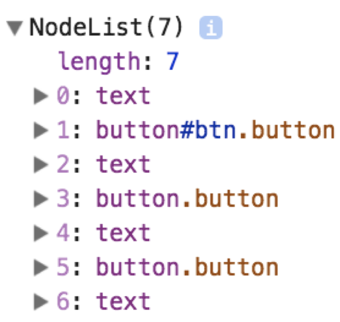

Node 对象提供了一系列的属性和方法用来利用 DOM 节点树结构中节点的关系实现遍历其中的节点。

> **关于节点之间的关系**，可以参考《DOM树结构》一节有关节点之间关系的内容。

## 获取父节点

通过 HTML 页面中指定元素查找其父级节点，我们可以使用 Node 对象的 parentNode 属性实现:

```javascript
pNode = node.parentNode;
```

在上述语法结构中，parentNode 属性返回指定节点的父节点。

> **值得注意的是:** 一个元素节点的父节点，可能是一个元素节点，也可能是一个文档节点。

以下代码示例，就是通过 parentNode 属性获取指定节点的父节点，再实现其他操作的:

```javascript
var btn = document.getElementById('btn');
var parentNode = btn.parentNode;
var className = parentNode.className;
className += ' animate';
parentNode.className = className;
```

### 获取父元素节点

Node 对象除了提供了 parentNode 属性可以获取指定节点的父节点之外，还提供了 parentElement 属性获取指定节点的父元素节点。

```javascript
parentElementNode = node.parentElement;
```

在上述语法结构中，parentElement 属性返回指定节点的父元素节点。

> **值得注意的是:** 如果一个节点没有父节点，或者父节点不是一个元素节点的话，parentElement 属性返回 null。

以下代码示例，就是通过 parentElement 属性获取指定节点的父元素节点，再实现其他操作的:

```javascript
var btn = document.getElementById('btn');
var parentElement = btn.parentElement;
var className = parentElement.className;
className += ' animate';
parentElement.className = className;
```

### 父节点与父元素节点的区别

所谓父节点，并没有指定某个节点的父节点一定是哪个类型的节点。而父元素节点，指定了某个节点的父节点一定是元素节点。

- parentNode: 获取指定节点的父节点，其父节点不一定是元素节点。
- parentElement: 获取指定节点的父元素节点，其父节点必须是元素节点。

如果我们获取 `<html>` 元素的父节点的话，就是 document 文档节点。而 document 文档节点并不是一个元素节点。如下述代码示例:

```javascript
// 获取 <html> 元素
var html = document.documentElement;
console.log('parentNode: ' + html.parentNode);
console.log('parentElement: ' + html.parentElement);
```

上述代码示例，输出的结果如下:


## 获取子节点

通过 HTML 页面中指定元素查找其子节点，我们可以通过以下 Node 对象的属性实现:

| 属性名 | 描述 |
| --- | --- |
| childNodes | 获取指定节点的所有子节点 |
| firstChild | 获取指定节点的第一个子节点 |
| lastChild | 获取指定节点的最后一个子节点 |

> **值得注意的是:** HTML 页面中某个元素的子节点不一定是唯一的。

### 获取所有子节点

Node 对象提供了 childNodes 属性用于获取 HTML 页面中指定节点的所有子节点:

```javascript
var ndList = Node.childNodes;
```

在上述语法结构中，childNodes 属性的返回值 ndList 是一个 NodeList 对象，并且为只读。该属性获取一个包含指定节点的所有子节点的集合。

> **值得注意的是:** childNodes 属性返回的是一个动态的 NodeList 对象。有关动态 NodeList 的内容，请参考《定位页面元素》一节的内容。

以下代码示例，就是通过指定节点获取其所有子节点，再实现其他操作的:

```javascript
var parentNode = document.getElementById('parent');
var children = parentNode.childNodes;
console.log(children);
```

上述代码示例，输出的结果如下:



我们会发现，获取到的所有子节点，除了真正的子节点 `<button>` 之外，还具有 4 个文本节点。

### 空白节点

主流浏览器解析 HTML 页面内容为 DOM 节点树结构时，会产生空文本的空白节点。这是由 HTML 页面源代码中的换行引起的:

```html
<div id="parent" class="button-group">
    <button id="btn" name="btn" class="button">A Button</button>
    <button name="btn" class="button">A Button</button>
    <button name="btn" class="button">A Button</button>
</div>
```

上述代码示例的 DOM 节点树结构如下图所示:


如果将 HTML 页面的源代码编写成一行时，这个空白节点的问题可以得到解决。但这种解决方式妨碍了我们代码的可读性，并不建议这样解决。

> **值得注意的是:** IE 8 及之前版本的浏览器中不存在空白节点问题。

### 空白节点的解决方案

在开发中，空白节点的问题将 DOM 节点树结构的解析及操作增加了不少的难度和麻烦。我们这里提供一种比较简单有效的解决方式:

1. 弃用 DOM 中 Node 对象用于获取指定节点的子节点和兄弟节点的属性。
2. 通过使用 getElementsByTagName() 方法实现相应功能。

比如我们要查找 HTML 页面指定元素的所有子节点的话，我们按照如下代码示例实现:

```javascript
var parentNode = document.getElementById('parent');
var children = parentNode.getElementsByTagName('button');
console.log(children);
```

上述代码示例运行的结果如下:


> 关于 DOM 中为什么要具有空白节点以及更完整的解决方案，可以参考 Mozilla 社区的[《DOM 中的空白符》](https://developer.mozilla.org/zh-CN/docs/Web/Guide/API/DOM/Whitespace_in_the_DOM)。

### 获取第一个子节点

Node 对象提供了 firstChild 属性用于获取指定节点的第一个子节点:

```javascript
var first_child = node.firstChild;
```

在上述语法结构中，firstChild 属性返回的 first_child 表示当前节点的第一个子节点的引用。

> **值得注意的是:** 如果当前节点无子节点，则 firstChild 属性返回 null。

以下代码示例，就是通过指定节点获取其第一个子节点，再实现其他操作的:

```javascript
var parentNode = document.getElementById('parent');
var firstChild = parentNode.firstChild;
```

通过上述代码示例，我们最终得到依旧是空白节点，而并非第一个子节点。

```javascript
var parentNode = document.getElementById('parent');
var firstChild = parentNode.getElementsByTagName('button')[0];
console.log(firstChild);
```

通过 getElementsByTagName() 方法替换之后，所得到的节点才是真正的第一个节点。

### 获取最后一个节点

Node 对象提供了 lastChild 属性用于获取指定节点的最后一个子节点:

```javascript
var last_child = node.lastChild;
```

在上述语法结构中，lastChild 属性返回的 last_child 表示当前节点的最后一个子节点的引用。

> **值得注意的是:** 如果当前节点无子节点，则 lastChild 属性返回 null。

以下代码示例，就是通过指定节点获取其最后一个子节点，再实现其他操作的:

```javascript
var parentNode = document.getElementById('parent');
var lastChild = parentNode.lastChild;
```

通过上述代码示例，我们最终得到依旧是空白节点，而并非最后一个子节点。

```javascript
var parentNode = document.getElementById('parent');
var children = parentNode.getElementsByTagName('button');
var lastChild = children[children.length-1];
```

通过 getElementsByTagName() 方法替换之后，所得到的节点才是真正的最后一个节点。

## 获取相邻兄弟节点

通过 HTML 页面中指定元素查找其相邻兄弟节点，我们可以通过以下 Node 对象的属性实现:

| 属性名 | 描述 |
| --- | --- |
| previousSibling | 获取指定节点的前面相邻兄弟节点 |
| nextSibling | 获取指定节点的后面相邻兄弟节点 |

### 获取相邻前面兄弟节点

Node 对象提供了 previousSibling 属性用于获取指定节点的前面相邻兄弟节点:

```javascript
previousNode = node.previousSibling;
```

在上述语法结构中，previousSibling 属性返回的 previousNode 表示当前节点的前一个兄弟节点。

> **值得注意的是:** 如果当前节点无前一个兄弟节点，则 previousSibling 属性返回 null。

以下代码示例，就是通过指定节点获取其前面相邻兄弟节点，再实现其他操作的:

```javascript
var elem = document.getElementById('btn');
var previousSibling = elem.previousSibling;
```

通过上述代码示例，我们最终得到依旧是空白节点，而并非前面相邻兄弟节点。

```javascript
// 判断获取的兄弟节点是否为元素节点
if ( previousSibling.nodeType != 1){
    previousSibling = previousSibling.previousSibling;
}
```

通过判断获取的节点类型是否为元素节点，实现如何获取真正的前面相邻兄弟节点。

### 获取相邻后面兄弟节点

Node 对象提供了 nextSibling 属性用于获取指定节点的后面相邻兄弟节点:

```javascript
nextNode = node.nextSibling;
```

在上述语法结构中，nextSibling 属性返回的 nextNode 表示当前节点的后一个兄弟节点。

> **值得注意的是:** 如果当前节点无后一个兄弟节点，则 nextSibling 属性返回 null。

以下代码示例，就是通过指定节点获取其后面相邻兄弟节点，再实现其他操作的:

```javascript
var elem = document.getElementById('btn');
var nextSibling = elem.nextSibling;
```

通过上述代码示例，我们最终得到依旧是空白节点，而并非后面相邻兄弟节点。

```javascript
// 判断获取的兄弟节点是否为元素节点
if ( nextSibling.nodeType != 1){
    nextSibling = nextSibling.nextSibling;
}
```

通过判断获取的节点类型是否为元素节点，实现如何获取真正的后面相邻兄弟节点。


