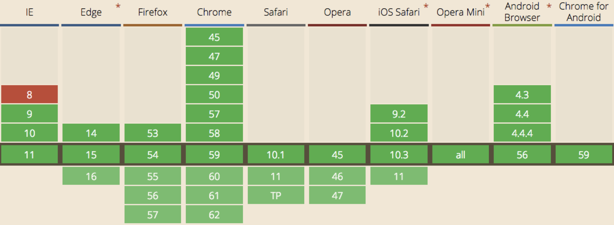

Element 对象提供了属性和方法实现定位页面元素功能。该对象与 Document 对象提供的属性和方法实现定位页面元素功能的区别在于，Document 对象定位的是 HTML 页面中所有指定元素，而 Element 对象定位的是指定元素内所有指定元素。

## 定位页面元素方法

目前 Document 对象提供实现定位页面元素的方法具有如下几种:

- getElementsByTagName()方法：通过页面元素的元素名定位元素。
- getElementsByClassName()方法：通过页面元素的 class 属性值定位元素。
- querySelector()方法：通过 CSS 选择器定位第一个匹配的元素。
- querySelectorAll()方法：通过 CSS 选择器定位所有匹配的元素。

接下来，我们就一一进行学习。

## 通过元素的元素名定位元素

其语法格式如下:

```javascript
elements = document.getElementsByTagName(name);
```

在上述语法中，name 是参数，表示所要定位元素的元素名，符号”*”表示所有元素。elements 是返回值，表示定位元素的集合，是一个 NodeList 集合。

下面是使用 getElementsByTagName() 方法的示例代码:

```javascript
var elems = document.getElementsByTagName('button');
// 循环遍历所有元素
for (var i=0; i<elems.length; i++) {
    var elem = elems[i]; 
    var className = elem.className; 
    className += ' animate'; 
    elem.className = className;
}
```

上述代码通过 getElementsByTagName() 方法定位 HTML 页面中元素名为 button 的元素，并遍历所有得到的元素，为其元素的 class 属性添加 animate 样式。

## 通过元素的 class 属性值定位元素

其语法格式如下:

```javascript
elements = document.getElementsByClassName(names);
```

在上述语法中，names 是参数，表示所要定位元素的 class 属性值列表，class 名称通过空格分隔。

> **值得注意的是:** names 参数可以是一个样式属性名称，也可以是多个样式属性名称。

elements 是返回值，表示定位元素的集合，是一个 NodeList 集合。

下面是使用 getElementsByClassName() 方法的示例代码:

```javascript
var elems = document.getElementsByClassName('btn');
// 循环遍历所有元素
for (var i=0; i<elems.length; i++) {
    var elem = elems[i]; 
    var className = elem.className; 
    className += ' animate'; 
    elem.className = className;
}
```

上述代码通过 getElementsByClassName() 方法定位 HTML 页面中 class 属性值为 btn 的元素，并遍历所有得到的元素，为其元素的 class 属性添加 animate 样式。

#### 兼容 IE 8 及之前版本的浏览器

getElementsByClassName() 方法只支持 IE 9 版本及之后版本的浏览器。也就是说，该方法并不支持 IE 8 及之前版本的浏览器。

下图是不同浏览器的不同版本对 getElementsByClassName() 方法的支持情况:



由于国内的生产环境中，依旧存在使用 IE 8 及之前版本浏览器的情况。所以，我们需要自定义 getElementsByClassName() 方法解决浏览器的兼容问题。

```javascript
function getElementsByClassName(element, names) {

}
```

上述自定义兼容方法接受两个参数，element 参数表示调用 getElementsByClassName() 方法的对象（目前为 Document 对象），names 参数表示所要定位元素的 class 属性值列表。

```javascript
function getElementsByClassName(element, names) {
    // 检测 getElementsByClassName() 是否可用
    if (element.getElementsByClassName) {
        // 优先使用 W3C 规范
        return element.getElementsByClassName(names);
    }else {
        // 人为解决 IE 8 之前版本不兼容问题

    }
}
```

这里我们要优先使用 W3C 规范的方法。所以，需要先判断当前浏览器环境是否存在 getElementsByClassName() 方法。

如果存在，就使用原本的 getElementsByClassName() 方法。如果不存在，就使用自定义代码来实现。

```javascript
function getElementsByClassName(element, names) {
    // 检测 getElementsByClassName() 是否可用
    if (element.getElementsByClassName) {
        // 优先使用 W3C 规范
        return element.getElementsByClassName(names);
    }else {
        // 人为解决 IE 8 之前版本不兼容问题
        
        // 获取所有后代元素节点
        var elements = element.getElementsByTagName('*');
        // 定义空数组
        var result = [];
        var element, classNameStr, flag;
        // 将样式名称改为数组类型
        names = names.split(' ');
        // 循环遍历所有元素节点
        for (var i=0; element = elements[i]; i++) {
        	  // 获取每个元素节点的样式名称
            classNameStr = ' ' + element.className + ' ';
            // 开启开关
            flag = true; 
            // 循环遍历所有的样式名称
            for (var j=0, name; name = names[j]; j++) {
                // 判断当前元素节点的样式名称中是否包含指定的样式名称
                if (classNameStr.indexOf(' ' + name + ' ') == -1){
                    // 如果不包含，则关闭开关，并且结束循环
                    flag = false;
                    break;
                }
            } 
            // 判断当前元素节点是否包含指定样式名称
            if (flag) {
                // 如果包含，则将当前元素节点添加到数组中
                result.push(element);
            }
        } 
        // 返回数组(所有包含指定样式名称的元素节点)
        return result;
    }
}
```

## 通过 CSS 选择器定位元素

CSS 中的选择器可以很便利地定位 HTML 页面元素，DOM 的标准规范中也提供类似的方法。

- querySelector(): 定位匹配选择器的第一个元素。
- querySelectorAll(): 定位匹配选择器的所有元素。

#### querySelector() 方法

其语法格式如下:

```javascript
element = document.querySelector(selectors);
```

在上述语法中，selectors 是参数，表示选择器，可以包含一个或多个 CSS 选择器，多个则以逗号分隔。element 是返回值，表示定位元素的集合，匹配的第一个元素。

下面是使用 querySelector() 方法的示例代码:

```javascript
var btn = document.querySelector(’#btn');
// 获取定位元素的 class 属性值
var className = btn.className;
// 添加 animate 动画样式
className += ' animate';
// 将新的 class 属性值设置
btn.className = className;
```

上述代码通过 querySelector() 方法定位 HTML 页面中 id 属性值为 btn 的元素，并为其元素的 class 属性添加 animate 样式。

#### querySelectorAll() 方法

其语法格式如下:

```javascript
elements = document.querySelectorAll(selectors);
```

在上述语法中，selectors 是参数，表示选择器，可以包含一个或多个 CSS 选择器，多个则以逗号分隔。elements 是返回值，表示定位元素的集合，是一个 NodeList 集合。

下面是使用 querySelectorAll() 方法的示例代码:

```javascript
var elems = document.querySelectorAll('button');
// 循环遍历所有元素
for (var i=0; i<elems.length; i++) {
    var elem = elems[i]; 
    var className = elem.className; 
    className += ' animate'; 
    elem.className = className;
}
```

上述代码通过 querySelectorAll() 方法定位 HTML 页面中元素名为 button 的元素，并遍历所有得到的元素，为其元素的 class 属性添加 animate 样式。

