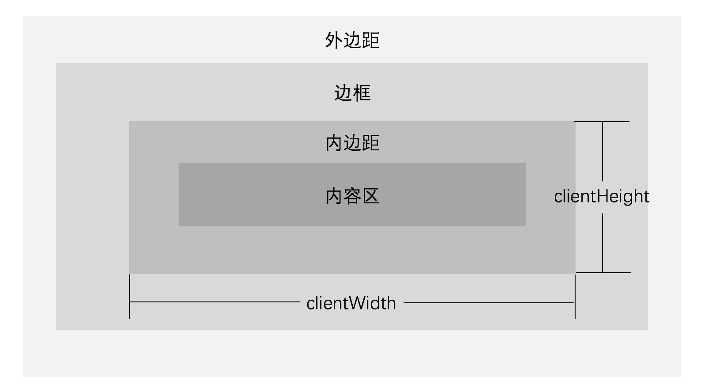
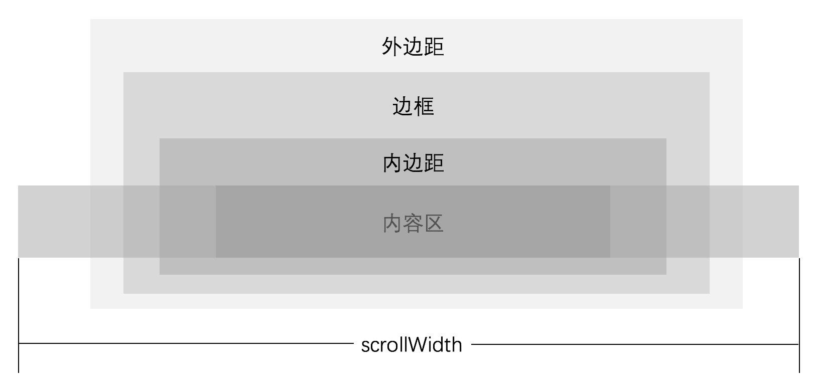
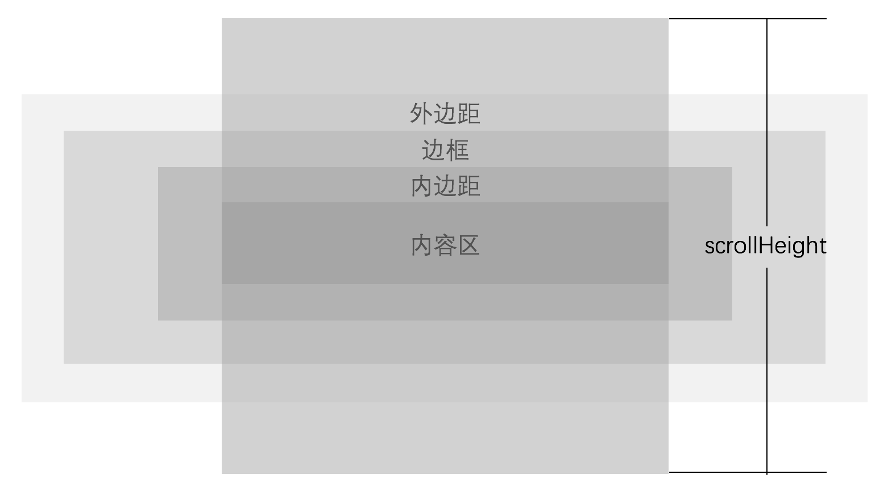
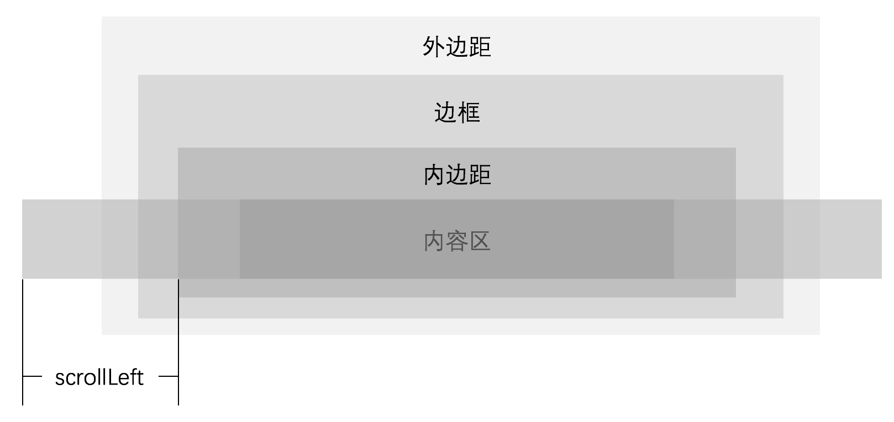
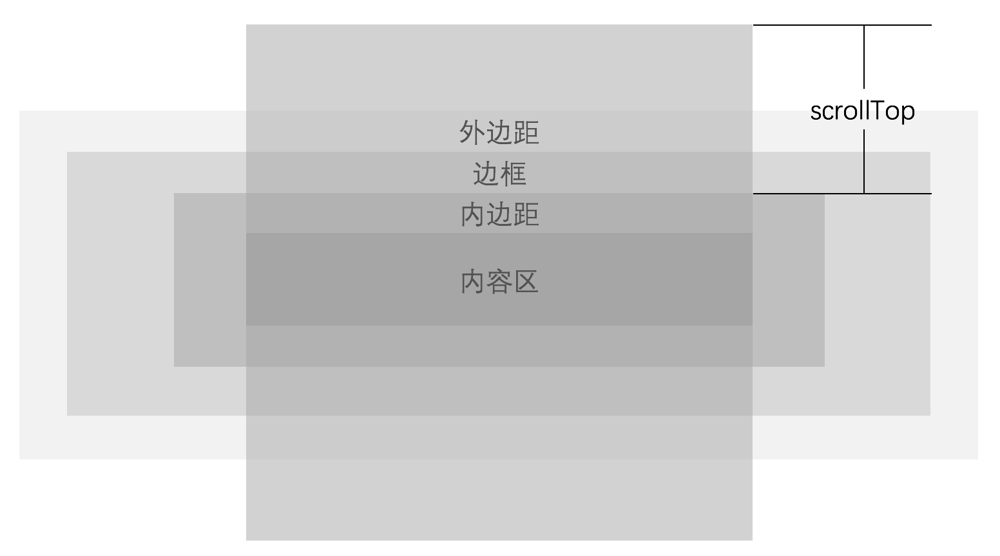
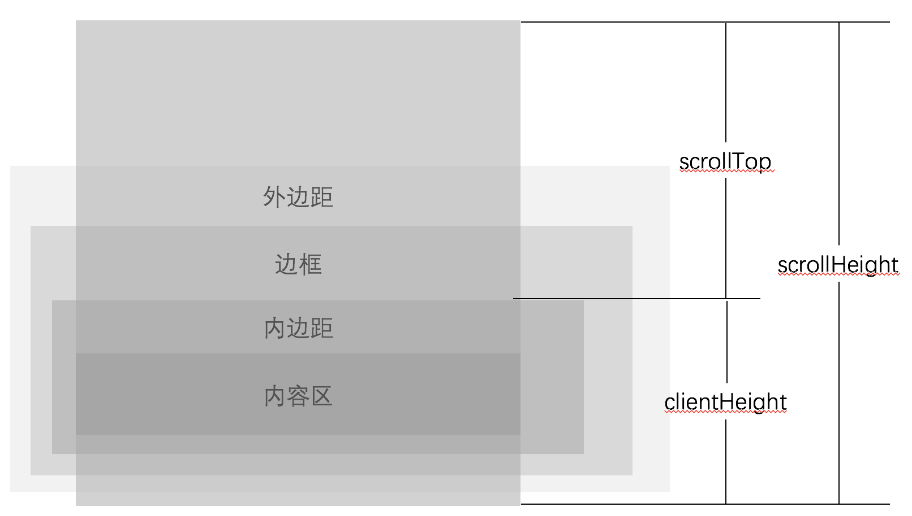

Element 对象提供一系列有关样式的属性:

- clientHeight 和 clientWidth 属性
- scrollHeight 和 scrollWidth 属性
- scrollTop 和 scrollLeft 属性

继承于 Element 对象的 HTMLElement 对象同样提供一系列有关样式的属性:

- offsetParent 属性
- offsetHeight 和 offsetWidth 属性
- offsetTop 和 offsetLeft 属性

## 元素内部的宽度和高度

Element 对象的 clientWidth 和 clientHeight 属性表示元素内部的宽度和高度，单位为像素。这些属性的值包含内边距，但不包含滚动条、边框和外边距。


我们也可以通过以下方式计算 clientWidth 和 clientHeight 属性:

```
clientWidth = CSS 的 width + CSS 的 padding – 滚动条的宽度（如果存在的话）
clientHeight = CSS 的 height + CSS 的 padding – 滚动条的高度（如果存在的话）
```

我们可以通过以下示例代码，学习测试 clientWidth 和 clientHeight 属性:

```javascript
var div = document.getElementById('d');
// 获取 div 的样式
var style = document.styleSheets[0].cssRules[0].style;
// 计算 clientWidth 属性的值
var clientWidth = parseInt(style.width) + parseInt(style.paddingLeft) + parseInt(style.paddingRight);
// 测试打印 clientWidth = width + padding-left + padding-right
console.log(div.clientWidth, clientWidth);
```

## 内容区的宽度和高度

Element 对象的 scrollWidth 属性表示元素内容的宽度，单位为像素。 scrollWidth 属性返回元素内容区的宽度和元素本身宽度中更大的那个值。


Element 对象的 scrollHeight 属性表示元素内容的高度，单位为像素。scrollHeight 属性包含 overflow 样式属性导致不可见的内容区。


我们可以通过以下示例代码，学习测试 scrollWidth 和 scrollHeight 属性:

```javascript
var div1 = document.getElementById('d1');
console.log(div1.scrollWidth);

var div2 = document.getElementById('d2');
console.log(div2.scrollHeight);
```

## 滚动条滚动的宽度和高度

Element 对象的 scrollLeft 属性表示滚动条到元素左边的距离，单位为像素。scrollLeft 属性的默认值为 0。


Element 对象的 scrollTop 属性表示滚动条到元素顶部的距离，单位为像素。scrollHeight 属性的默认值为 0。


## 判断元素内容是否滚动到底

如果元素内容滚动到底的话，如下等式返回的结果为 true，否则返回为 false:

```
element.scrollHeight - element.scrollTop === element.clientHeight
```



## 获取指定元素的定位父元素

Element 对象提供的 offsetParent 属性用于返回一个指向最近的包含该元素的定位元素。其语法结构如下:

```javascript
var parentObj = element.offsetParent;
```

上述语法结构中，作为返回值的 parentObj 表示一个指向最近的包含该元素的定位元素。

> **值得注意的是:** 如果祖先元素中没有开始定位，则 offsetParent 为 body 元素。

我们可以通过以下示例代码，学习 offsetParent 属性的使用:

```html
<style>
    #parent { position: relative; }
</style>
<script>
    var btn = document.getElementById('btn');
    console.log(btn.offsetParent);
</script>
```

### offsetParent 属性的浏览器兼容性

在不同浏览器中，对 offsetParent 属性的支持情况也有所不同:

- 在 Webkit 中，如果元素为隐藏的（该元素或其祖先元素的 style.display 为 "none"），或者该元素的 style.position被设为 "fixed"，则该属性返回 null。
- 在 IE 9 中，如果该元素的 style.position 被设置为 "fixed"，则该属性返回 null。（display:none 无影响。）

### 获取指定元素的定位相关属性

与开启定位相关的属性还有以下几种:

- 指定元素的 offsetWidth 和 offsetHeight 属性分别表示该元素的布局宽度和布局高度，其中包含边框、内边距、滚动条和 CSS 设置的宽度或高度的值。
- 指定元素的 offsetLeft 和 offsetTop 属性分别表示该元素距离定位父元素左边界和上边界的距离。

> **值得注意的是:** offsetWidth、offsetHeight、offsetLeft 和 offsetTop 属性的值都是整数。

