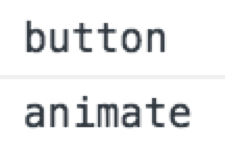

## 类选择器设置 CSS 样式

通过 CSS 的类选择器为 HTML 页面中的元素定义 CSS 样式，是我们开发中比较常见的一种方式。

我们也可以通过 HTML 页面元素 class 属性获取其对应的 CSS 样式。

```html
<style>
    .button {
        background-color: orange;
    }
</style>
```

## Element 对象的 className 属性

Element 对象提供了 className 属性用于获取 HTML 页面中指定元素的 class 属性值。

> **值得注意的是:** Element 对象提供的是 className 属性，并不是 class 属性。原因是 class 在 JavaScript 中是关键字。

className 属性的的语法结构如下:

```javascript
var cName = elementNodeReference.className;
```

上述语法结构中，className 属性返回值 cName 表示一个字符串变量。表示当前元素的class属性的值，可以是由空格分隔的多个class属性值。

我们可以通过以下示例代码，学习 className 属性的使用:

```javascript
var btn = document.getElementById('btn');
console.log(btn.className);
```

上述示例代码输出的结果如下:


## Element 对象的 classList 属性

Element 对象的 className 属性虽然可以获取 HTML 页面中指定元素的 class 属性值，但返回值的是字符串类型。如果 HTML 页面中指定元素的 class 属性值为多个样式的话，对于我们操作会比较麻烦。

Element 对象还提供了 classList 属性，该属性可以获取 HTML 页面指定元素的 class 属性值的列表。其语法结构如下:

```javascript
var elementClasses = elementNodeReference.classList;
```

上述语法结构中，classList 属性返回值 elementClasses 表示HTML 页面元素的 class 属性值所组成的列表。

我们可以通过以下示例代码，学习 classList 属性的使用:

```javascript
var btn = document.getElementById('btn');
var elemClasses = btn.classList;
for(var i=0; i<elemClasses.length; i++){
    var elemClass = elemClasses[i];
    console.log(elemClass);
}
```

上述示例代码输出的结果如下:



## 浏览器兼容问题

Element 对象的 classList 属性，在 IE 8 及之前版本的浏览器中并不支持。所以，我们要想在各个浏览器中都支持该属性。

需要在 HTML 页面中引入以下 JavaScript 文件:

```javascript
/*
 * classList.js: Cross-browser full element.classList implementation.
 * 1.1.20170427
 *
 * By Eli Grey, http://eligrey.com
 * License: Dedicated to the public domain.
 *   See https://github.com/eligrey/classList.js/blob/master/LICENSE.md
 */

/*global self, document, DOMException */

/*! @source http://purl.eligrey.com/github/classList.js/blob/master/classList.js */

if ("document" in self) {

// Full polyfill for browsers with no classList support
// Including IE < Edge missing SVGElement.classList
if (!("classList" in document.createElement("_")) 
	|| document.createElementNS && !("classList" in document.createElementNS("http://www.w3.org/2000/svg","g"))) {

(function (view) {

"use strict";

if (!('Element' in view)) return;

var
	  classListProp = "classList"
	, protoProp = "prototype"
	, elemCtrProto = view.Element[protoProp]
	, objCtr = Object
	, strTrim = String[protoProp].trim || function () {
		return this.replace(/^\s+|\s+$/g, "");
	}
	, arrIndexOf = Array[protoProp].indexOf || function (item) {
		var
			  i = 0
			, len = this.length
		;
		for (; i < len; i++) {
			if (i in this && this[i] === item) {
				return i;
			}
		}
		return -1;
	}
	// Vendors: please allow content code to instantiate DOMExceptions
	, DOMEx = function (type, message) {
		this.name = type;
		this.code = DOMException[type];
		this.message = message;
	}
	, checkTokenAndGetIndex = function (classList, token) {
		if (token === "") {
			throw new DOMEx(
				  "SYNTAX_ERR"
				, "An invalid or illegal string was specified"
			);
		}
		if (/\s/.test(token)) {
			throw new DOMEx(
				  "INVALID_CHARACTER_ERR"
				, "String contains an invalid character"
			);
		}
		return arrIndexOf.call(classList, token);
	}
	, ClassList = function (elem) {
		var
			  trimmedClasses = strTrim.call(elem.getAttribute("class") || "")
			, classes = trimmedClasses ? trimmedClasses.split(/\s+/) : []
			, i = 0
			, len = classes.length
		;
		for (; i < len; i++) {
			this.push(classes[i]);
		}
		this._updateClassName = function () {
			elem.setAttribute("class", this.toString());
		};
	}
	, classListProto = ClassList[protoProp] = []
	, classListGetter = function () {
		return new ClassList(this);
	}
;
// Most DOMException implementations don't allow calling DOMException's toString()
// on non-DOMExceptions. Error's toString() is sufficient here.
DOMEx[protoProp] = Error[protoProp];
classListProto.item = function (i) {
	return this[i] || null;
};
classListProto.contains = function (token) {
	token += "";
	return checkTokenAndGetIndex(this, token) !== -1;
};
classListProto.add = function () {
	var
		  tokens = arguments
		, i = 0
		, l = tokens.length
		, token
		, updated = false
	;
	do {
		token = tokens[i] + "";
		if (checkTokenAndGetIndex(this, token) === -1) {
			this.push(token);
			updated = true;
		}
	}
	while (++i < l);

	if (updated) {
		this._updateClassName();
	}
};
classListProto.remove = function () {
	var
		  tokens = arguments
		, i = 0
		, l = tokens.length
		, token
		, updated = false
		, index
	;
	do {
		token = tokens[i] + "";
		index = checkTokenAndGetIndex(this, token);
		while (index !== -1) {
			this.splice(index, 1);
			updated = true;
			index = checkTokenAndGetIndex(this, token);
		}
	}
	while (++i < l);

	if (updated) {
		this._updateClassName();
	}
};
classListProto.toggle = function (token, force) {
	token += "";

	var
		  result = this.contains(token)
		, method = result ?
			force !== true && "remove"
		:
			force !== false && "add"
	;

	if (method) {
		this[method](token);
	}

	if (force === true || force === false) {
		return force;
	} else {
		return !result;
	}
};
classListProto.toString = function () {
	return this.join(" ");
};

if (objCtr.defineProperty) {
	var classListPropDesc = {
		  get: classListGetter
		, enumerable: true
		, configurable: true
	};
	try {
		objCtr.defineProperty(elemCtrProto, classListProp, classListPropDesc);
	} catch (ex) { // IE 8 doesn't support enumerable:true
		// adding undefined to fight this issue https://github.com/eligrey/classList.js/issues/36
		// modernie IE8-MSW7 machine has IE8 8.0.6001.18702 and is affected
		if (ex.number === undefined || ex.number === -0x7FF5EC54) {
			classListPropDesc.enumerable = false;
			objCtr.defineProperty(elemCtrProto, classListProp, classListPropDesc);
		}
	}
} else if (objCtr[protoProp].__defineGetter__) {
	elemCtrProto.__defineGetter__(classListProp, classListGetter);
}

}(self));

}

// There is full or partial native classList support, so just check if we need
// to normalize the add/remove and toggle APIs.

(function () {
	"use strict";

	var testElement = document.createElement("_");

	testElement.classList.add("c1", "c2");

	// Polyfill for IE 10/11 and Firefox <26, where classList.add and
	// classList.remove exist but support only one argument at a time.
	if (!testElement.classList.contains("c2")) {
		var createMethod = function(method) {
			var original = DOMTokenList.prototype[method];

			DOMTokenList.prototype[method] = function(token) {
				var i, len = arguments.length;

				for (i = 0; i < len; i++) {
					token = arguments[i];
					original.call(this, token);
				}
			};
		};
		createMethod('add');
		createMethod('remove');
	}

	testElement.classList.toggle("c3", false);

	// Polyfill for IE 10 and Firefox <24, where classList.toggle does not
	// support the second argument.
	if (testElement.classList.contains("c3")) {
		var _toggle = DOMTokenList.prototype.toggle;

		DOMTokenList.prototype.toggle = function(token, force) {
			if (1 in arguments && !this.contains(token) === !force) {
				return force;
			} else {
				return _toggle.call(this, token);
			}
		};

	}

	testElement = null;
}());

}
```

该文件的下载地址为: [https://github.com/eligrey/classList.js/blob/master/classList.js](https://github.com/eligrey/classList.js/blob/master/classList.js)

