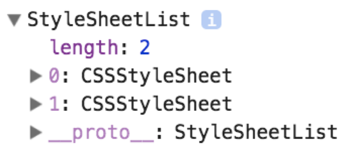
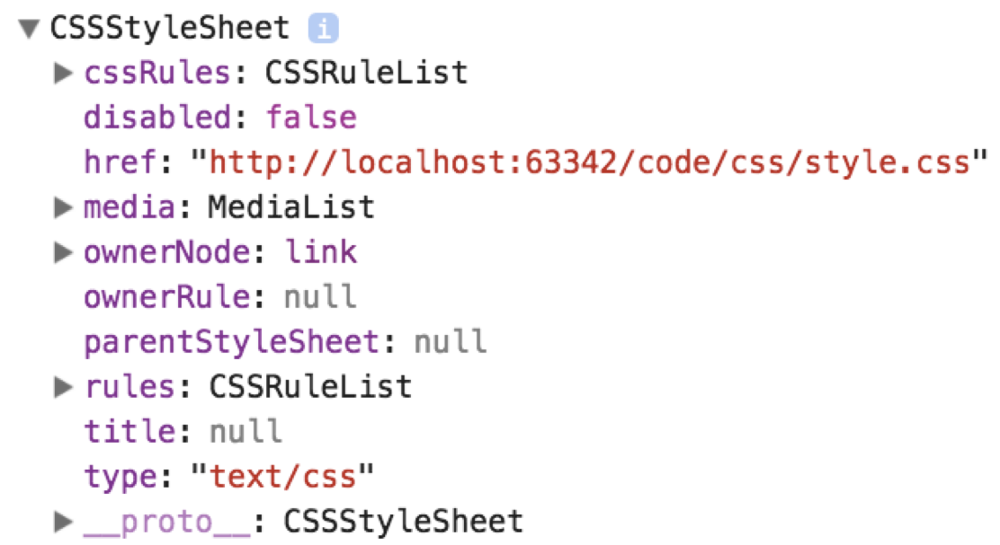
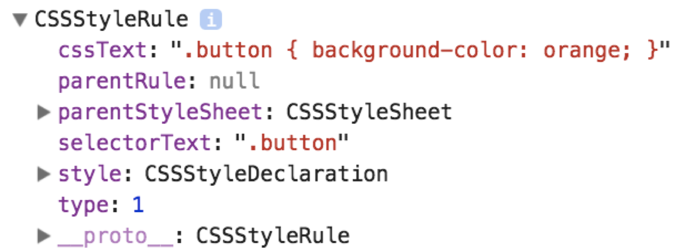

## 回顾什么是外联样式

所谓外联样式，就是在 HTML 页面中内嵌样式表或者引入外部样式文件，再通过 CSS 选择器定位 HTML 页面元素，为其定义样式。

以下示例代码，就是定义外联样式表:

```html
<link rel="stylesheet" href="css/style.css">
```

上述示例代码，通过 `<link>` 元素引入外部的样式表。

```html
<style>
    .button {
        background-color: orange;
    }
</style>
```

上述示例代码，通过 `<style>` 元素定义内嵌样式表。

## Document 对象的 styleSheets 属性

Document 对象提供了 styleSheets 属性，该属性返回包含所有外联样式表（内嵌样式表和外联样式表）的集合对象。

```javascript
var styleSheetList = document.styleSheets;
```

上述语法结构中，作为返回值的 styleSheetList 是一个由 styleSheet 对象组成的列表，每个 styleSheet 对象表示 HTML 页面中内嵌样式表或外联样式表。

我们可以通过打印该属性值进行测试:

```javascript
console.log(document.styleSheets);
```

上述示例代码输出的结果如下:



## StyleSheetList 对象

Document 对象的 styleSheets 属性返回的是一个 StyleSheetList 对象。该对象是一个类数组对象，可以通过 for 循环语句进行遍历，或者将其转换为数组。

> **值得注意的是:** StyleSheetList 对象本身不能使用数组方法进行操作。

我们可以通过以下示例代码，测试研究 StyleSheetList 对象:

```javascript
var styleSheetList = document.styleSheets;
for (var i=0; i<styleSheetList.length; i++){
    console.log(styleSheetList[i]);
}
```

上述示例代码中，每次循环得到的是 StyleSheet 对象。

## CSSStyleSheet 对象

CSSStyleSheet 对象表示一个 CSS 样式表（内嵌样式表或外联样式表）。CSSStyleSheet 实现了更为通用的 StyleSheet，也从其父级 StyleSheet 继承了属性和方法。

我们可以通过打印该对象进行测试:

```javascript
console.log(document.styleSheets[0]);
```

上述示例代码输出的结果如下:



## CSSRuleList 对象

CSSStyleSheet 对象的 cssRules 属性返回的是一个 CSSRuleList 对象。该对象是一个类数组对象，可以通过 for 循环语句进行遍历，或者将其转换为数组。

我们可以通过以下示例代码，测试研究 CSSRuleList 对象:

```javascript
var styleSheet = document.styleSheets[0];
var cssRuleList = styleSheet.cssRules;
for(var i=0; i<cssRuleList.length; i++){
    var cssRule = cssRuleList[i];
    console.log(cssRule);
}
```

上述示例代码中，每次循环得到是 CSSRule 对象。

## CSSRule 对象

CSSRule 对象表示一个 CSS 规则。一个 CSS 样式表包含了一组 CSS 规则。

CSSRule 对象的常见属性：

- style：返回 CSSStyleDeclaration 对象
- cssText：CSS 规则
- selectorText：选择器

我们可以通过以下示例代码，测试研究 CSSRule 对象:

```javascript
console.log(document.styleSheets[1].cssRules[0]);
```

上述示例代码输出的结果如下:




