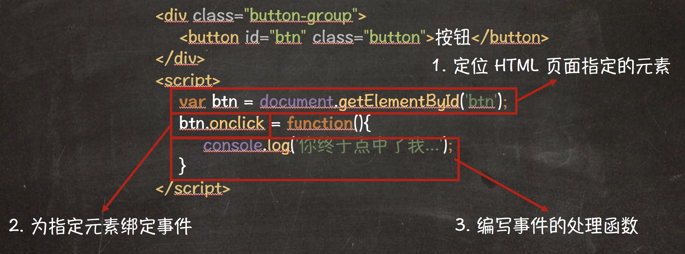

所谓事件，就是浏览器告知 JavaScript 程序用户的行为。例如用户点击了 HTML 页面中的某个按钮，或者用户输入用户名或密码等操作。

如下示例代码，演示了如何通过事件完成用户点击按钮后的逻辑:

```html
<div class="button-group">
    <button id="btn" class="button">按钮</button>
</div>
<script>
    var btn = document.getElementById('btn');
    btn.onclick = function(){
        console.log('你终于点中了我...');
    }
</script>
```

根据上述示例代码，具体执行流程如下:



## 事件类型

事件根据使用的场景不同，可以分为如下几种:

- 依赖于设备的输入事件：键盘事件和鼠标事件，这些事件都是直接和设备相关的。
- 独立于设备的输入事件：例如 click 事件等，这些事件并没有直接与设备相关。
- 用户界面的相关事件：用户界面事件属于较高级的事件，一般多用于表单中的组件。
- 状态变化的相关事件：这些事件与用户行为无关，而是由网络或浏览器触发的。
- 特定 API 事件：这些事件多用于特定场景的实现，例如 HTML5 中提供的拖放 API 中的事件等。
- 与错误处理的相关事件

## 键盘事件

键盘事件，主要是指当用户操作电脑键盘时所触发的事件。主要的键盘事件如下:

| 事件名称 | 描述 |
| --- | --- |
| keydown | 用户按下一个按键。|
| keypress | 用户按下并释放一个按键。如果该按键不是修饰键时，触发该事件。|
| keyup | 用户释放一个按键。|

> **值得注意的是:** 如果是切换指示灯的状态，如Caps Lock键，Num Lock键和Scroll Lock键。这些按键仅发送 keydown 事件和 keyup 事件。

## 鼠标事件

鼠标事件，主要是指当用户操作电脑鼠标时所触发的事件。主要的鼠标事件如下:

| 事件名称 | 描述 |
| --- | --- |
| mousedown | 用户按下鼠标按键。|
| mouseup | 用户释放鼠标按钮。|
| mouseover | 用户移动鼠标到指定元素上。|
| mousemove | 用户鼠标移动。|
| mouseout | 用户将鼠标从指定元素上移除。|

## 独立于设备的输入事件

独立于设备的事件，主要是指当这些事件没有与指定设备相关联。具有如下几种:

| 事件名称 | 描述 |
| --- | --- |
| click | 用户点击一下。|
| dblclick | 用户连续点击两下。|
| contextmenu | 用户点击鼠标右键打开上下文菜单。|

## 状态变化的相关事件

状态变化的相关事件，主要是指网络或浏览器的状态发生改变。具有如下几种:

| 事件名称 | 描述 |
| --- | --- |
| load | 表示 HTML 页面或图片加载完毕。|
| unload | 表示离开或关闭 HTML 页面。|
| resize | 表示浏览器窗口被重新调整的大小。|
| scroll | 表示 HTML 页面滚动。|

