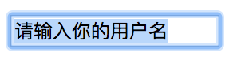
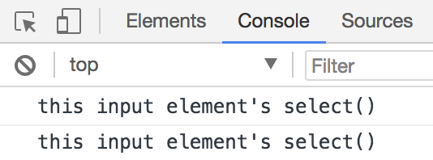

表单元素的组件主要分为 `<input>`、`<textarea>` 和 `<select>` 这三种元素。但由于 `<input>` 元素的 type 属性值较多，实际情况要更复杂一些。

上述三种表单组件元素中，`<input>` 和 `<textarea>` 元素都表示文本框，`<select>` 表示下拉列表。所以，表单组件的操作主要可以分为以下两种:

1. 文本框的操作: 主要是针对 `<input>` 和 `<textarea>` 两种元素
2. 下拉列表的操作: 主要是针对 `<select>` 和 `<option>` 两种元素

## 文本框的操作

input 元素对应 DOM 中的对象是 HTMLInputElement 对象，而 textarea 元素对应 DOM 中的对象是 HTMLTextAreaElement 对象。

HTMLInputElement 对象和 HTMLTextAreaElement 对象的共同父级对象是 HTMLElement 对象。所以，这两个对象在很多操作上是比较相似的。当然，也有一些不同之处。

接下来，我们就针对这两个元素的操作，进行详细的学习。

### 文本内容的选择

HTMLInputElement 对象和 HTMLTextAreaElement 对象都提供了 select() 方法，该方法用于选择当前文本框的所有文本内容。

我们可以通过以下示例代码，学习 select() 方法的使用:

```html
<form id="myform" action="#">
    <input type="text" id="username" name="username" value="请输入你的用户名">
</form>
<script>
    var username = document.getElementById('username');
    username.select();
</script>
```

上述示例代码运行后的效果如下图所示:



> **说明:** textarea 元素与 input 元素的效果类似，这里我们就不再提供示例代码了。

select() 方法多与文本框的获取焦点事件配合使用。效果就是当某个文本框获取焦点时，自动将文本框的默认提示内容全部选中。例如如下示例代码:

```html
<form id="myform" action="#">
    <input type="text" id="username" name="username" value="请输入你的用户名">
</form>
<script>
    var username = document.getElementById('username');
    username.addEventListener('focus',function(){
        username.select();
    });
</script>
```

上述示例代码的运行效果是: 当用户使用鼠标点击该文本框时，触发 focus 事件。同时将该文本框的文本内容全部选中。

#### 1. select 事件

select() 方法对应着 select 事件。也就是说，当调用 select() 方法时，会触发 select 事件。

我们可以通过以下示例代码，对 select 事件进行学习:

```html
<form id="myform" action="#">
    <input type="text" id="username" name="username" value="请输入你的用户名">
</form>
<script>
    var username = document.getElementById('username');
    username.addEventListener('focus',function(){
        username.select();
    });

    username.addEventListener('select',function(){
        console.log("this input element's select()");
    });
</script>
```

上述示例代码的运行效果是: 当用户使用鼠标点击该文本框时，触发 focus 事件。同时将该文本框的文本内容全部选中，并触发 select 事件。如下图所示:



> **说明:** 上述输出结果为两次，并非一次。原因是调用 select() 方法会触发一次 select 事件，选择指定文本框的文本内容也会再触发一次 select 事件。

选择指定文本框的文本内容时触发 select 事件，在不同浏览器中情况也不尽相同。具体如下:

1. 如果是 IE9+、Chrome、Firefox、Opera 以及 Safari 浏览器中，必须在用户选择文本内容并释放鼠标时，才会触发 select 事件
2. 如果是 IE8 及之前版本的浏览器，则是在用户选择文本内容时（没有释放鼠标）就触发了 select 事件。

#### 2. 获取选择的文本内容

select 事件只是让我们知道用户在什么时候选择了指定文本框的文本内容，但并不能让我们知道用户选择了什么文本内容。

HTML5 新版本中通过新增两个属性来解决用户选择了什么文本内容的问题。

| 属性名 | 描述 |
| --- | --- |
| selectionStart | 选择文本内容的开始索引值 |
| selectionEnd | 选择文本内容的结束索引值 |

我们可以通过如下示例代码方式，得到用户选择的文本内容:

```html
<form id="myform" action="#">
    <input type="text" id="username" name="username" value="请输入你的用户名">
</form>
<script>
    var username = document.getElementById('username');

    username.addEventListener('select',function(){
        var textValue = username.value;
        var result = textValue.substring(username.selectionStart, username.selectionEnd);
        console.log(result);
    });
</script>
```

> **注意:** IE8 及之前版本的浏览器并不支持上述两个属性，而是提供了 document.selection 对象，用于保存整个 HTML 页面文档范围内选择的文本内容。

#### 3. 获取部分的文本内容

HTML5 新版本中提供了 setSelectionRange() 方法，该方法用于从一个获取焦点的文本框中选择指定的文本内容。

setSelectionRange() 方法语法格式如下:

```javascript
inputElement.setSelectionRange(selectionStart, selectionEnd, [optional] selectionDirection);
```

在上述语法格式中的参数，具体说明如下:

| 参数名 | 描述 |
| --- | --- |
| selectionStart | 被选中的第一个字符的位置 |
| selectionEnd | 被选中的最后一个字符的 下一个 位置 |
| selectionDirection | 一个指明选择方向的字符串。有 "forward"、"backward" 和 "none" 3个可选值, 分别表示"从前往后", "从后往前"和"选择方向未知或不重要" |

我们可以通过如下示例代码，学习 setSelectionRange() 方法的使用:

```html
<form id="myform" action="#">
    <input type="text" id="username" name="username" value="请输入你的用户名">
</form>
<script>
    var username = document.getElementById('username');

    username.addEventListener('focus',function(){
        username.setSelectionRange(0, -1);// 全部选中
    });
</script>
```

> **注意:** IE8 及之前版本的浏览器并不支持这个方法。

