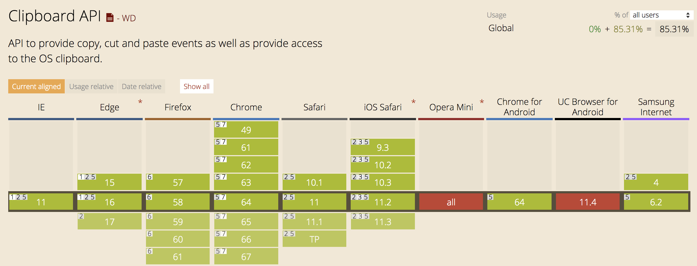

表单元素的组件主要分为 `<input>`、`<textarea>` 和 `<select>` 这三种元素。但由于 `<input>` 元素的 type 属性值较多，实际情况要更复杂一些。

上述三种表单组件元素中，`<input>` 和 `<textarea>` 元素都表示文本框，`<select>` 表示下拉列表。所以，表单组件的操作主要可以分为以下两种:

1. 文本框的操作: 主要是针对 `<input>` 和 `<textarea>` 两种元素
2. 下拉列表的操作: 主要是针对 `<select>` 和 `<option>` 两种元素

## 文本框的操作

input 元素对应 DOM 中的对象是 HTMLInputElement 对象，而 textarea 元素对应 DOM 中的对象是 HTMLTextAreaElement 对象。

HTMLInputElement 对象和 HTMLTextAreaElement 对象的共同父级对象是 HTMLElement 对象。所以，这两个对象在很多操作上是比较相似的。当然，也有一些不同之处。

接下来，我们就针对这两个元素的操作，进行详细的学习。

### 文本内容的选择

HTMLInputElement 对象和 HTMLTextAreaElement 对象都提供了 select() 方法，该方法用于选择当前文本框的所有文本内容。

我们可以通过以下示例代码，学习 select() 方法的使用:

```html
<form id="myform" action="#">
    <input type="text" id="username" name="username" value="请输入你的用户名">
</form>
<script>
    var username = document.getElementById('username');
    username.select();
</script>
```

上述示例代码运行后的效果如下图所示:


> **说明:** textarea 元素与 input 元素的效果类似，这里我们就不再提供示例代码了。

select() 方法多与文本框的获取焦点事件配合使用。效果就是当某个文本框获取焦点时，自动将文本框的默认提示内容全部选中。例如如下示例代码:

```html
<form id="myform" action="#">
    <input type="text" id="username" name="username" value="请输入你的用户名">
</form>
<script>
    var username = document.getElementById('username');
    username.addEventListener('focus',function(){
        username.select();
    });
</script>
```

上述示例代码的运行效果是: 当用户使用鼠标点击该文本框时，触发 focus 事件。同时将该文本框的文本内容全部选中。

#### 1. select 事件

select() 方法对应着 select 事件。也就是说，当调用 select() 方法时，会触发 select 事件。

我们可以通过以下示例代码，对 select 事件进行学习:

```html
<form id="myform" action="#">
    <input type="text" id="username" name="username" value="请输入你的用户名">
</form>
<script>
    var username = document.getElementById('username');
    username.addEventListener('focus',function(){
        username.select();
    });

    username.addEventListener('select',function(){
        console.log("this input element's select()");
    });
</script>
```

上述示例代码的运行效果是: 当用户使用鼠标点击该文本框时，触发 focus 事件。同时将该文本框的文本内容全部选中，并触发 select 事件。如下图所示:


> **说明:** 上述输出结果为两次，并非一次。原因是调用 select() 方法会触发一次 select 事件，选择指定文本框的文本内容也会再触发一次 select 事件。

选择指定文本框的文本内容时触发 select 事件，在不同浏览器中情况也不尽相同。具体如下:

1. 如果是 IE9+、Chrome、Firefox、Opera 以及 Safari 浏览器中，必须在用户选择文本内容并释放鼠标时，才会触发 select 事件
2. 如果是 IE8 及之前版本的浏览器，则是在用户选择文本内容时（没有释放鼠标）就触发了 select 事件。

#### 2. 获取选择的文本内容

select 事件只是让我们知道用户在什么时候选择了指定文本框的文本内容，但并不能让我们知道用户选择了什么文本内容。

HTML5 新版本中通过新增两个属性来解决用户选择了什么文本内容的问题。

| 属性名 | 描述 |
| --- | --- |
| selectionStart | 选择文本内容的开始索引值 |
| selectionEnd | 选择文本内容的结束索引值 |

我们可以通过如下示例代码方式，得到用户选择的文本内容:

```html
<form id="myform" action="#">
    <input type="text" id="username" name="username" value="请输入你的用户名">
</form>
<script>
    var username = document.getElementById('username');

    username.addEventListener('select',function(){
        var textValue = username.value;
        var result = textValue.substring(username.selectionStart, username.selectionEnd);
        console.log(result);
    });
</script>
```

> **注意:** IE8 及之前版本的浏览器并不支持上述两个属性，而是提供了 document.selection 对象，用于保存整个 HTML 页面文档范围内选择的文本内容。

#### 3. 获取部分的文本内容

HTML5 新版本中提供了 setSelectionRange() 方法，该方法用于从一个获取焦点的文本框中选择指定的文本内容。

setSelectionRange() 方法语法格式如下:

```javascript
inputElement.setSelectionRange(selectionStart, selectionEnd, [optional] selectionDirection);
```

在上述语法格式中的参数，具体说明如下:

| 参数名 | 描述 |
| --- | --- |
| selectionStart | 被选中的第一个字符的位置 |
| selectionEnd | 被选中的最后一个字符的 下一个 位置 |
| selectionDirection | 一个指明选择方向的字符串。有 "forward"、"backward" 和 "none" 3个可选值, 分别表示"从前往后", "从后往前"和"选择方向未知或不重要" |

我们可以通过如下示例代码，学习 setSelectionRange() 方法的使用:

```html
<form id="myform" action="#">
    <input type="text" id="username" name="username" value="请输入你的用户名">
</form>
<script>
    var username = document.getElementById('username');

    username.addEventListener('focus',function(){
        username.setSelectionRange(0, -1);// 全部选中
    });
</script>
```

> **注意:** IE8 及之前版本的浏览器并不支持这个方法。

### 过滤输入

在实际开发中，我们经常需要用户输入特定的内容，或者过滤不允许用户输入的内容。而利用 DOM 中的事件和 JavaScript 语言中的一些内容，就可以将一个普通的文本输入框改变成带有功能的控件。

#### 1. 屏蔽字符

有时候，我们需要用户输入特定的文本内容或者不能输入特定的文本内容，例如电话号码中不能出现非数字的文本内容等。

我们可以通过为指定文本输入框元素注册 keypress 事件，并且在该事件的处理函数中阻止默认行为的方式实现屏蔽字符的功能。如下示例代码所示:

```html
<form id="myform" action="#">
    <input type="text" id="username" name="username" value="请输入你的用户名">
</form>
<script>
    var username = document.getElementById('username');

    username.addEventListener('keypress',function(event){
        event.preventDefault();// 阻止默认行为
    });
</script>
```

上述示例代码阻止了 keypress 事件，导致该文本输入框元素变成了只读的。

> **注意:** 上述示例代码无法屏蔽中文输入法输入的文本内容。

当然，如果想要屏蔽指定的文本内容的话，只需在 keypress 事件的处理函数中利用正则表达式检测用户输入的内容，再做出相应的反馈即可。如下示例代码所示:

```html
<form id="myform" action="#">
    <input type="text" id="username" name="username" value="请输入你的用户名">
</form>
<script>
    var username = document.getElementById('username');

    username.addEventListener('keypress',function(event){
        var charCode = event.key;
        console.log(charCode);
        if (!/\d/.test(charCode)) {
            event.preventDefault();// 阻止默认行为
        }
    });
</script>
```

上述示例代码中在 keypress 事件的处理函数中，先是获取了用户输入的文本内容，再判断是否为数字，如果不是则阻止输入。换句话讲，上述示例代码实现了只能允许用户输入数字内容。

#### 2. 操作剪切板

剪切板功能是经常被忽略，却很重要的功能，可以增强用户体验，方便用户交互。以下三个事件是剪切板的主要操作:

| 事件名称 | 描述 |
| --- | --- |
| copy | 在发生复制操作时触发，对应的快捷键为 Ctrl/Cmd + C |
| cut | 在发生剪切操作时触发，对应的快捷键为 Ctrl/Cmd + X |
| paste | 在发生粘贴操作时触发，对应的快捷键为 Ctrl/Cmd + V |

由于没有针对剪贴板操作的标准，这些事件及相关对象会因浏览器而异。如下图所示，就是上述三个事件的浏览器兼容性情况:



我们可以通过以下示例代码，学习上述三个事件的使用:

```html
<form id="myform" action="#">
    <input type="text" id="username" name="username" value="请输入你的用户名">
</form>
<script>
    var username = document.getElementById('username');

    username.addEventListener('copy',callback);
    username.addEventListener('cut',callback);
    username.addEventListener('paste',callback);

    function callback(event){
        var target = event.target || event.srcElement;
        target.value = event.type;
    }
</script>
```

上述示例代码将触发的事件类型输出在指定的输入框中。

Event 事件对象的 clipboardData 属性存储了由用户触发剪切板事件时所影响的带有 MIME 类型的数据。

> **注意:** 如果是 IE 8及之前版本的浏览器的话，clipboardData 属性需要通过 window 对象获取。

```javascript
var clipboardData = event.clipboardData || window.clipboardData;
```

该属性得到的是一个 DataTransfer 对象，该对象提供了操作数据的常用方法，如下表所示:

| 方法名称 | 描述 |
| --- | --- |
| setData(in String type, in String data) | 为一个给定的类型设置数据 |
| getData(in String type) | 根据指定的类型检索数据 |
| clearData([in String type]) | 删除与给定类型关联的数据 |

我们可以通过以下示例代码，学习如何使用上述 DataTransfer 对象的三个方法:

```html
<form id="myform" action="#">
    请输入你的用户名
    <input type="text" id="username" name="username" value="">
</form>
<script>
    var username = document.getElementById('username');
    username.addEventListener('paste',function(event){
        var target = event.target || event.srcElement;
        var clipboardData = event.clipboardData || window.clipboardData;

        var value = clipboardData.getData('text');
        target.value = value;

        event.preventDefault();
    });
</script>
```

上述示例代码禁用了默认的粘贴事件，通过 clipboardData 属性的 getData() 方法获取剪切板中的数据并赋值给指定的输入框。

## 下拉列表的操作

下拉列表是由 `<select>` 和 `<option>` 元素创建的。`<select>` 元素在 DOM 中对应的是 HTMLSelectElement 对象，`<option>` 元素在 DOM 中对应的是 HTMLOptionElement 对象，这两个对象都提供了一些属性和方法，方便操作下拉列表。

### HTMLSelectElement 对象

HTMLSelectElement 对象是 `<select>` 元素在 DOM 中对应的对象，在表单中获取该元素可以通过如下示例代码所示的方式:

```javascript
var selectbox = document.forms[0].elements['location'];
```

上述示例代码中，`elements[]` 中传递的是 `<select>` 元素的 name 属性值。

HTMLSelectElement 对象提供的属性如下表所示:

| 属性名称 | 描述 |
| --- | --- |
| length | 表示当前 `<select>` 元素中 `<option>` 元素的个数 |
| multiple | 表示 `<select>` 元素是否允许多项选择，等价于 HTML 中的 multiple 属性 |
| options | 当前 `<select>` 元素中 `<option>` 元素对象的集合 |
| selectedIndex | 代表第一个被选中的 `<option>` 元素。-1 代表没有元素被选中 |
| size | 当前 `<select>` 元素中可见的行数，等价于 HTML 中的 size 属性 |

#### 1. 下拉单选框

下拉单选框就是指每次只能选择一个 `<option>` 元素的下拉列表。

我们可以通过如下示例代码，学习如何使用上述 HTMLSelectElement 对象的属性:

```html
<form id="myform" name="myform" action="#">
    <select name="sex" id="mysex">
        <option value="male">男</option>
        <option value="female">女</option>
    </select>
</form>
<script>
    var selectbox = document.forms[0].elements['sex'];

    console.log('下拉列表<option>元素的个数: ' + selectbox.length);
    console.log('下拉列表被选中的<option>元素的索引值:' + selectbox.selectedIndex);
</script>
```

> **注意:** selectedIndex 属性只能返回第一个被选中的 `<option>` 元素的索引值。

#### 2. 下拉多选框

下拉多选框就是指每次可以选择多个 `<option>` 元素的下拉列表（**必须定义 multiple 属性**），并且可以通过 size 属性设置默认显示的个数。

我们可以通过如下示例代码，学习如何使用上述 HTMLSelectElement 对象的属性:

```html
<form id="myform" name="myform" action="#">
    <select name="location" id="mylocation" multiple size="5">
        <option value="beijing">北京</option>
        <option value="nanjing">南京</option>
        <option value="tianjin">天津</option>
        <option value="chongqing">重庆</option>
    </select>
</form>
<script>
    var selectbox = document.forms[0].elements['location'];

    console.log('第一个下拉列表是否为多选:' + selectbox.multiple);
    console.log('第一个下拉列表默认显示的个数:' + selectbox.size);
</script>
```

HTMLSelectElement 对象提供的方法如下表所示:

| 属性名称 | 描述 |
| --- | --- |
| add(item[, before]) | 将 `<option>` 元素添加到当前 `<select>` 元素的选项元素集合中 |
| item(idx) | 放回索引值为 idx 的 `<option>` 元素。如果没有，则返回 null |
| remove(index) | 从当前 `<select>` 元素的选项元素集合中删除指定索引值的 `<option>` 元素 |

#### 3. 添加选项

想要动态创建 `<option>` 元素并且添加到指定 `<select>` 元素的选项列表中的话，可以有多种方式实现。

第一种方式，利用之前已经掌握创建节点的方式实现。如下示例代码所示:

```html
<form id="myform" name="myform" action="#">
    <select name="location" id="mylocation" multiple size="5">
        <option value="beijing">北京</option>
        <option value="nanjing">南京</option>
        <option value="tianjin">天津</option>
        <option value="chongqing">重庆</option>
    </select>
</form>
<script>
    var selectbox = document.forms[0].elements['location'];

    var optionElem = document.createElement('option');
    optionElem.appendChild(document.createTextNode('上海'));
    optionElem.setAttribute('value','shanghai');

    selectbox.appendChild(optionElem);
</script>
```

第二种方式，通过 HTMLOptionElement 对象的构造函数 Option() 实现。如下示例代码所示:

```html
<form id="myform" name="myform" action="#">
    <select name="location" id="mylocation" multiple size="5">
        <option value="beijing">北京</option>
        <option value="nanjing">南京</option>
        <option value="tianjin">天津</option>
        <option value="chongqing">重庆</option>
    </select>
</form>
<script>
    var selectbox = document.forms[0].elements['location'];

    var optionElem = new Option('上海','shanghai');

    selectbox.appendChild(optionElem);
</script>
```

> **注意:** 上述的第二种方式在 IE 8及之前版本的浏览器，不能正确设置新选项的文本。

第三种方式，利用 HTMLSelectElement 对象的 add() 方法实现。如下示例代码所示:

```html
<form id="myform" name="myform" action="#">
    <select name="location" id="mylocation" multiple size="5">
        <option value="beijing">北京</option>
        <option value="nanjing">南京</option>
        <option value="tianjin">天津</option>
        <option value="chongqing">重庆</option>
    </select>
</form>
<script>
    var selectbox = document.forms[0].elements['location'];

    var optionElem = new Option('上海','shanghai');

    selectbox.add(optionElem);
</script>
```

上述示例代码，将新选项添加到了 `<select>` 元素的选项集合中的最后面。如果想要添加到指定位置的话，可以通过如下示例代码所示的方式实现:

```html
<form id="myform" name="myform" action="#">
    <select name="location" id="mylocation" multiple size="5">
        <option value="beijing">北京</option>
        <option value="nanjing">南京</option>
        <option value="tianjin">天津</option>
        <option value="chongqing">重庆</option>
    </select>
</form>
<script>
    var selectbox = document.forms[0].elements['location'];
    var oldOptn = selectbox.options[2];

    var optionElem = new Option('上海','shanghai');
    
    selectbox.add(optionElem, oldOptn);
</script>
```

上述三种方式实现添加选项，建议使用第三种方式。第三种方式不仅代码更少，而且没有浏览器兼容性问题。

#### 2. 删除选项

和添加选项类似，删除选项也具有多种方式实现。首先，第一种方式就是使用 DOM 中 Node 对象的 removeChild() 方法实现。如下示例代码所示:

```html
<form id="myform" name="myform" action="#">
    <select name="location" id="mylocation" multiple size="5">
        <option value="beijing">北京</option>
        <option value="nanjing">南京</option>
        <option value="tianjin">天津</option>
        <option value="chongqing">重庆</option>
    </select>
</form>
<script>
    var selectbox = document.forms[0].elements['location'];

    selectbox.removeChild(selectbox.options[1]);// 删除第二个选项
</script>
```

第二种方式，利用 HTMLSelectElement 对象的 remove() 方法实现。如下示例代码所示:

```html
<form id="myform" name="myform" action="#">
    <select name="location" id="mylocation" multiple size="5">
        <option value="beijing">北京</option>
        <option value="nanjing">南京</option>
        <option value="tianjin">天津</option>
        <option value="chongqing">重庆</option>
    </select>
</form>
<script>
    var selectbox = document.forms[0].elements['location'];

    selectbox.remove(1);// 删除第二个选项
</script>
```

第三种方式，利用 null 值释放资源的特性实现。如下示例代码所示:

```html
<form id="myform" name="myform" action="#">
    <select name="location" id="mylocation" multiple size="5">
        <option value="beijing">北京</option>
        <option value="nanjing">南京</option>
        <option value="tianjin">天津</option>
        <option value="chongqing">重庆</option>
    </select>
</form>
<script>
    var selectbox = document.forms[0].elements['location'];

    selectbox.options[1] = null;// 删除第二个选项
</script>
```

### HTMLOptionElement 对象

HTMLOptionElement 对象是 `<option>` 元素在 DOM 中对应的对象，在表单中获取该元素可以通过如下示例代码所示的方式:

```javascript
var optElem = selectbox.options[index];
```

而不推荐通过如下方式获取  `<option>` 元素:

```javascript
var optElem = selectbox.childNodes[index];
```

上述这种方式可能出现空白节点问题。当然，我们还可以利用 Element 对象的 getElementsByTagName() 方法获取:

```javascript
var opsElem = selectbox.getElementsByTagName('option')[index];
```

上述这种方式是通过查找 DOM 树结构实现。

HTMLOptionElement 对象提供的方法如下表所示:

| 属性名称 | 描述 |
| --- | --- |
| index | 当前 `<option>` 元素在其所属的选项列表中的索引值 |
| selected | 表示当前 `<option>` 元素是否被选中 |
| text | 当前 `<option>` 元素的文本内容 |
| value | 当前 `<option>` 元素的 value 属性值 |

我们可以通过如下示例代码，学习如何使用 HTMLOptionElement 对象的属性:

```html
<form id="myform" name="myform" action="#">
    <select name="location" id="mylocation">
        <option value="beijing">北京</option>
        <option value="nanjing">南京</option>
        <option value="tianjin">天津</option>
        <option value="chongqing">重庆</option>
    </select>
</form>
<script>
    var selectbox = document.forms[0].elements['location'];
    var optElem = selectbox.options[0];

    console.log('当前选项的索引值: ' + optElem.index);
    console.log('当前选项是否被选中: ' + optElem.selected);
    console.log('当前选项的文本为: ' + optElem.text);
    console.log('当前选项的value为: ' + optElem.value);
</script>
```