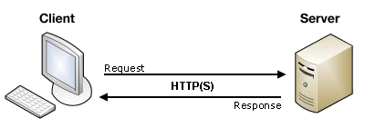

提交表单，实际上就是将表单内组件用户输入的数据内容发送给指定的服务器端。例如用户登录、用户注册、购买商品的提交订单等功能，都是通过提交表单实现的。例如如下示例代码所示，就是一个简单的表单提交代码:

```html
<form action="#">
    <input type="text" name="data">
    <input type="submit" value="提交">
</form>
```

> **说明:** 上述示例代码作为演示作用，不需要掌握。

## 客户端/服务器体系结构

当在页面中提交表单时，表单中的数据内容发生了什么呢？实际上，所有的 Web 应用程序都是具有两端的，一个是客户端（PC 端或者移动端等），一个是服务器端，客户端和服务器端才构成一个比较完整的 Web 应用程序。

客户端通过提交表单使用 HTTP 协议将数据内容发送给服务器端，服务器端使用同样的协议对客户端做出回应。如下图所示:



需要说明的是，客户端页面中的表单不过是提供给用户一个友好的体验。完全可以通过 HTTP 协议的请求协议完成数据的发送工作。

> **说明:** 关于 HTTP 协议的内容，会有专门的教程讲解。

## 定义如何发送数据

表单想要实现提交功能，必须要配合使用提交按钮才能实现。只要在表单中出现如下任意一个按钮，都可以实现提交表单的功能:

- 提交按钮: `<input type="submit" value="提交">`
- 自定义提交按钮: `<button type="submit">提交</button>`
- 图像按钮: `<input type="image" src="graphic.gif">`

当然，想要提交表单，需要一个 `<form>` 表单元素配合一个提交按钮只是最基本的要求。而 `<form>` 表单元素也提供了与发送数据相关的两个属性。

### action 属性

action 属性定义了发送数据的位置，该属性的值必须是一个有效的 URL。如果没有提供此属性，则数据将被发送到包含表单的页面的 URL。

该属性的值可以是一个绝对的 URL，如下示例代码所示:

```html
<form action="http://www.longestory.com"></form>
```

也可以是一个相对的 URL，如下示例代码所示:

```html
<form action="/login"></form>
```

在没有定义 action 属性的值时，表单数据会被发送到当前表单所在页面的 URL 上。如下示例代码所示:

```html
<form></form>
```

上述示例代码，需要注意的是这是 HTML5 的写法，也就是说，在 HTML5 版本之前，上述情况要写成如下示例代码所示:

```html
<form action="#"></form>
```

### method 属性

method 属性定义了发送数据的方式，该属性的值由 HTTP 协议提供，主要使用的是 GET 和 POST 两种。

#### 1. GET 方式

#### 2. POST 方式

### enctype 属性

## 如何提交表单

### submit() 方法

### submit 事件

## 扩展内容

### 跨站脚本攻击(XSS)

### 跨站点请求伪造攻击(CSRF)