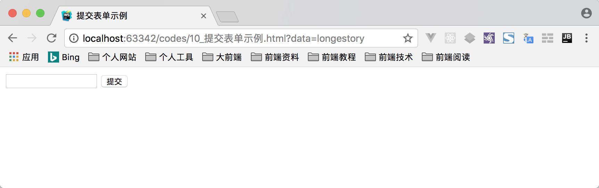
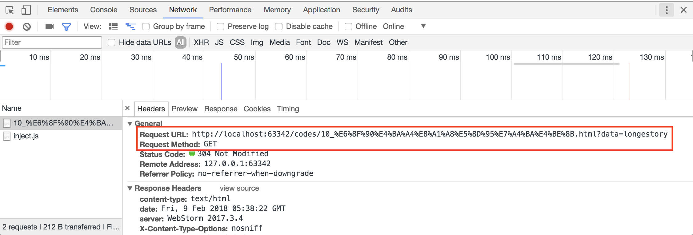
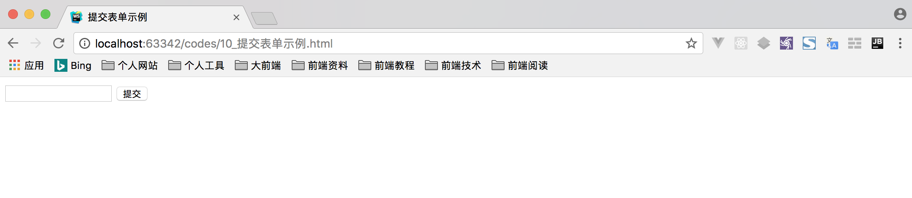
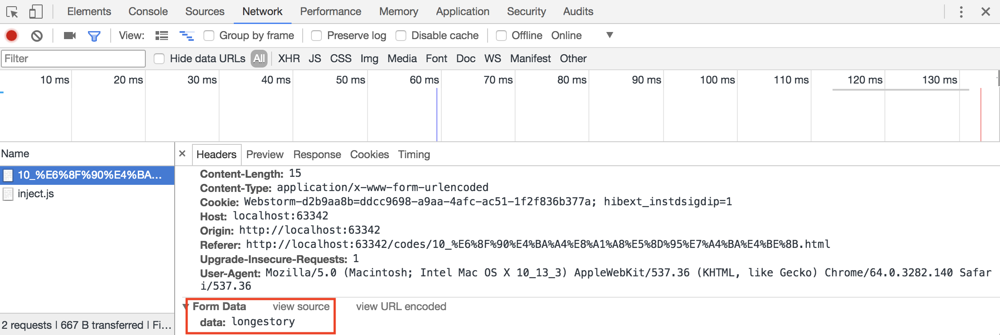
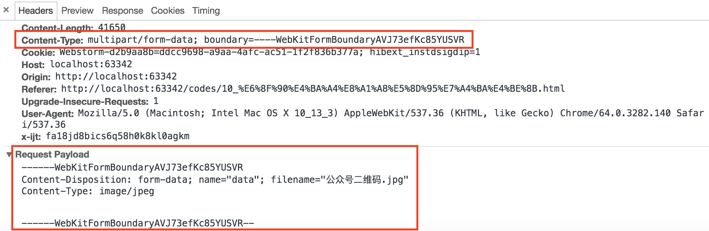
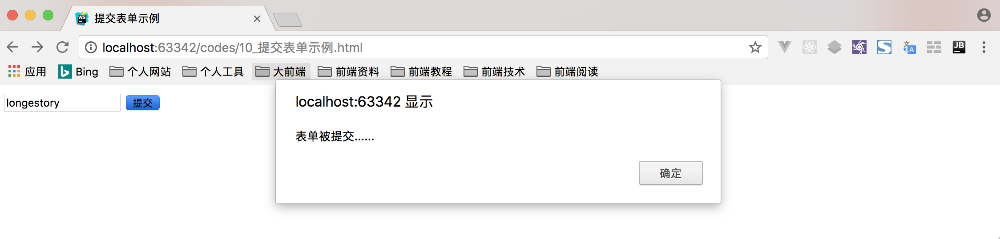

提交表单，实际上就是将表单内组件用户输入的数据内容发送给指定的服务器端。例如用户登录、用户注册、购买商品的提交订单等功能，都是通过提交表单实现的。例如如下示例代码所示，就是一个简单的表单提交代码:

```html
<form action="#">
    <input type="text" name="data">
    <input type="submit" value="提交">
</form>
```

> **说明:** 上述示例代码作为演示作用，不需要掌握。

## 客户端/服务器体系结构

当在页面中提交表单时，表单中的数据内容发生了什么呢？实际上，所有的 Web 应用程序都是具有两端的，一个是客户端（PC 端或者移动端等），一个是服务器端，客户端和服务器端才构成一个比较完整的 Web 应用程序。

客户端通过提交表单使用 HTTP 协议将数据内容发送给服务器端，服务器端使用同样的协议对客户端做出回应。如下图所示:


需要说明的是，客户端页面中的表单不过是提供给用户一个友好的体验。完全可以通过 HTTP 协议的请求协议完成数据的发送工作。

> **说明:** 关于 HTTP 协议的内容，会有专门的教程讲解。

## 定义如何发送数据

表单想要实现提交功能，必须要配合使用提交按钮才能实现。只要在表单中出现如下任意一个按钮，都可以实现提交表单的功能:

- 提交按钮: `<input type="submit" value="提交">`
- 自定义提交按钮: `<button type="submit">提交</button>`
- 图像按钮: `<input type="image" src="graphic.gif">`

当然，想要提交表单，需要一个 `<form>` 表单元素配合一个提交按钮只是最基本的要求。而 `<form>` 表单元素也提供了与发送数据相关的两个属性。

### action 属性

action 属性定义了发送数据的位置，该属性的值必须是一个有效的 URL。如果没有提供此属性，则数据将被发送到包含表单的页面的 URL。

该属性的值可以是一个绝对的 URL，如下示例代码所示:

```html
<form action="http://www.longestory.com"></form>
```

也可以是一个相对的 URL，如下示例代码所示:

```html
<form action="/login"></form>
```

在没有定义 action 属性的值时，表单数据会被发送到当前表单所在页面的 URL 上。如下示例代码所示:

```html
<form></form>
```

上述示例代码，需要注意的是这是 HTML5 的写法，也就是说，在 HTML5 版本之前，上述情况要写成如下示例代码所示:

```html
<form action="#"></form>
```

### method 属性

method 属性定义了发送数据的方式，该属性的值由 HTTP 协议提供，主要使用的是 GET 和 POST 两种。

#### 1. GET 方式

GET 方式是表单提交默认使用的请求方式。可以通过如下示例代码测试 GET 方式:

```html
<form action="#" method="get">
    <input type="text" name="data">
    <input type="submit" value="提交">
</form>
```

通过上述示例代码提交表单的话，可以在浏览器的地址栏中看到如下图所示的结果:



如上图所示，数据被附加到 URL 作为一系列的名称/值对。在 URL 地址结束之后，包括一个问号(?)，后面是名称/值对，每一个都由一个与符号(&)分隔开。

通过浏览器提供的开发者工具的 Network 功能抓取网络信息，会得到如下图所示的效果:



通过 GET 方式提交表单的话，会有以下问题:

- GET 方式提交表单数据大小有限制，理论上最多只能是 1024 字节
- GET 方式提交表单将数据添加到浏览器的地址栏，安全性较低

#### 2. POST 方式

POST 方式是表单提交比较常用的请求方式。可以通过如下示例代码测试 POST 方式:

```html
<form action="#" method="post">
    <input type="text" name="data">
    <input type="submit" value="提交">
</form>
```

通过上述示例代码提交表单的话，可以发现在浏览器的地址栏中并没有任何变化，如下图所示:



如上图所示，POST 方式提交表单时数据并没有被添加到 URL 地址中，而是被添加到了 HTTP 请求协议中。如下图所示:



### enctype 属性

表单中还具有一个比较特殊的属性 enctype，该属性定义提交表单时所生成的请求中的 Content-Type 的 HTTP 数据头的值。

enctype 属性的默认值为 `application/x-www-form-urlencoded`，该值的含义就是表示“这是已编码为URL参数的表单数据”。还具有另一个值为 `multipart/form-data`，可用于实现文件上传功能。如果想要实现文件上传功能，需要同时满足以下三个条件:

- 将表单的 method 属性值设置为 POST
- 将表单的 enctype 属性值设置为 `multipart/form-data`
- 表单组件中至少定义一个文件域

可以通过如下示例代码测试文件上传功能:

```html
<form action="" method="post" enctype="multipart/form-data">
    <input type="file" name="data">
    <input type="submit" value="上传">
</form>
```

上述示例代码运行后的结果如下图所示:



如上图所示，可以看到 HTTP 请求协议中的 `Content-Type` 的值被修改为 `multipart/form-data`，这是由表单的 enctype 属性的值决定的。一旦设置为 `multipart/form-data` 值之后，表示表单提交的是二进制数据，可用于实现文件上传。

## 如何提交表单

### submit 事件

以上述方式提交表单时，会触发 submit 事件。可以通过如下示例代码进行测试:

```html
<form action="" method="post">
    <input type="text" name="data">
    <input type="submit" value="提交">
</form>
<script>
    var myform = document.forms[0];
    myform.addEventListener('submit',function(){
        alert('表单被提交......');
    });
</script>
```

上述示例代码运行后的效果如下图:



如果在 submit 事件的处理函数中通过 event 事件对象的 preventDefault() 方法可以阻止表单提交。换句话讲，在该事件的处理函数中可以完成表单验证的逻辑内容。

### submit() 方法

表单还提供了 submit() 方法用于提交表单，使用该方法时允许表单内使用任一普通按钮即可（并非提交按钮）。

可以通过如下示例代码测试 submit() 方法的使用:

```html
<form action="" method="post">
    <input type="text" name="data">
    <input id="btn" type="button" value="提交">
</form>
<script>
    var btn = document.getElementById('btn');
    btn.addEventListener('click',function(){
        var myform = document.forms[1];
        myform.submit();
    });
</script>
```

上述示例代码中，首先为按钮注册 click 事件，然后在 click 事件的处理函数中获取表单并调用 submit() 方法，最终实现提交表单的功能。

> **注意:** 使用 submit() 方法提交表单不会触发 submit 事件。

