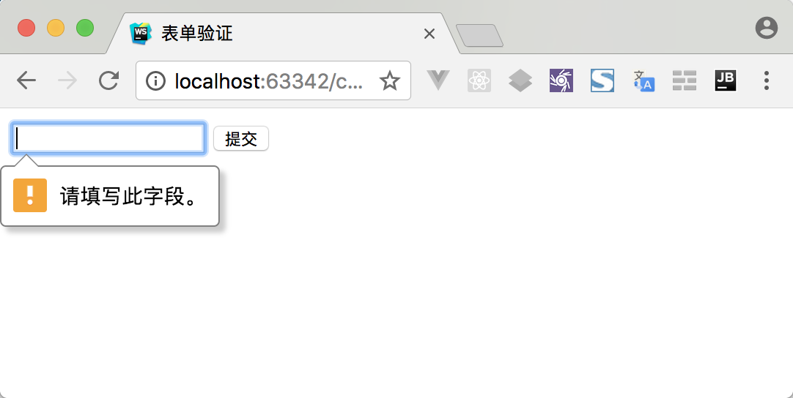
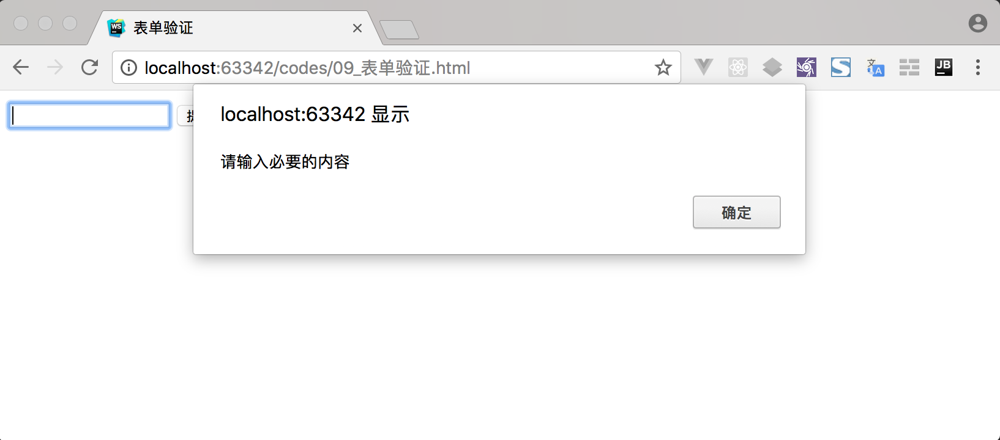
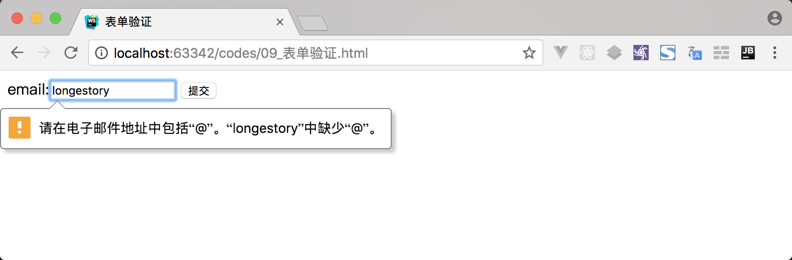
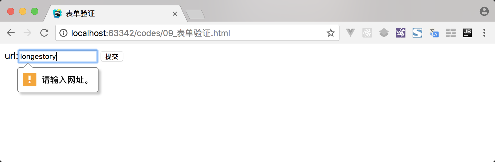
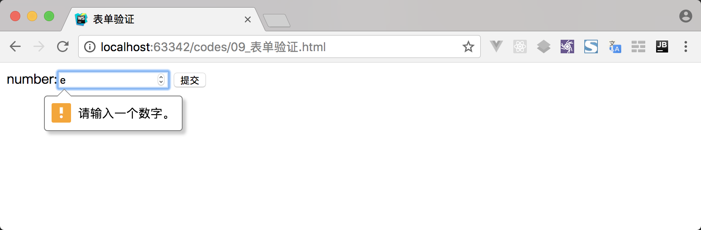
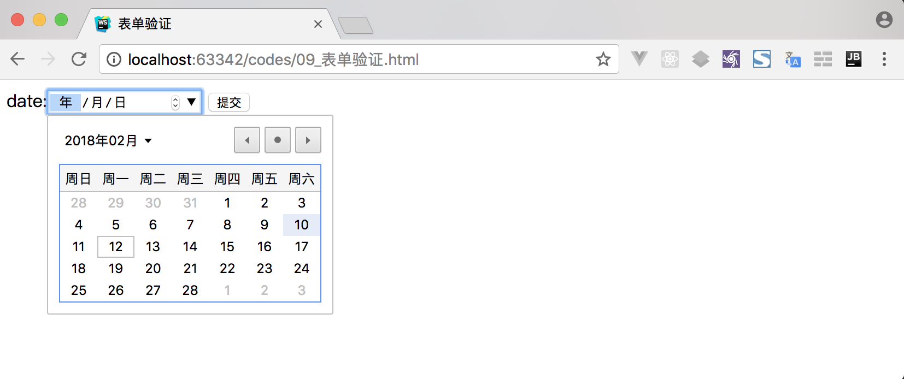
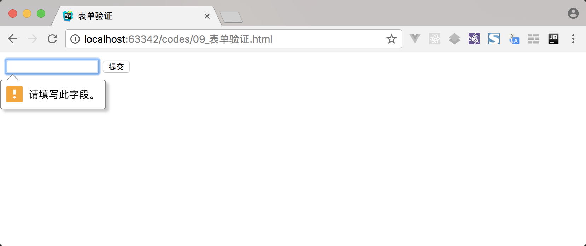
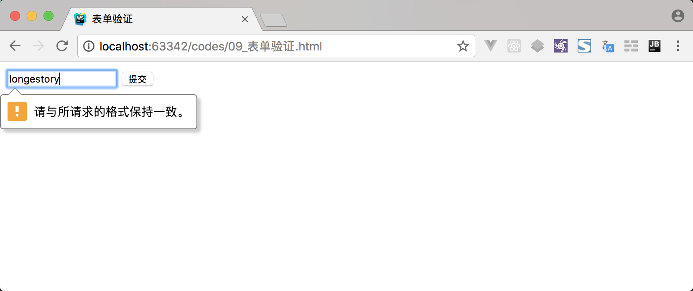
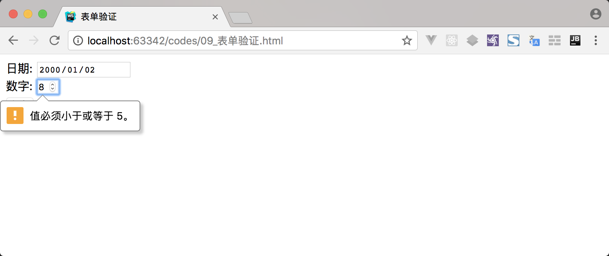
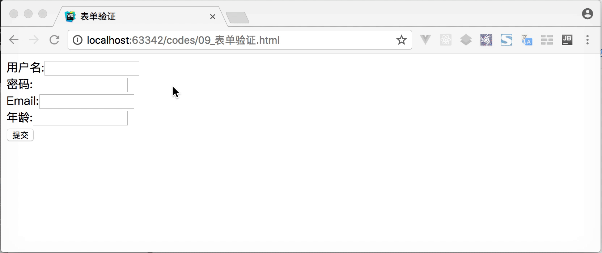

所谓表单验证，就是用户输入内容的格式是否与开发人员预定义的要求相符。如下图所示:



上述示例演示了用户输入内容不能为空的效果。当然，真正的表单验证还可以完成很多类似这样的功能，例如输入一个合法的 Email 地址等功能。

之所以需要表单验证这样的功能，主要原因如以下几种:

- 希望用户输入符合产品要求格式的内容。比如用户在注册用户时使用的用户名可能是中文，这可能会引起一些问题，可以通过表单验证要求用户输入符合格式要求的用户名等。
- 有效保护用户数据。比如用户在注册用户时所使用的密码过于简单，可以通过表单验证要求用户输入符合格式要求的复杂密码等。
- 有效保护产品安全。如果没有表单验证，用户可能会输入任何带有恶意的内容。

目前，表单验证的实现手段主要有以下两种方式实现:

- 客户端页面的表单验证。这种方式主要是在提交表单之前，验证用户输入的数据是否符合要求。如果符合则提交表单，如果不符合则要求用户重新输入。
- 服务器端的校验。这种方式就是表单提交给服务器端，服务器端接收客户端的请求数据后，进行数据的校验工作。然后，根据校验结果做出相应的反馈。

> 本教程主要以客户端的表单验证为主进行讲解。

## JavaScript 验证

JavaScript 方式的表单验证主要应用在 HTML5 版本发布之前，通过 JavaScript 代码逻辑自定义表单验证功能。

通过 JavaScript 代码方式实现表单验证功能，主要具有以下几种方式的实现:

- 主动过滤用户输入内容（这部分内容，可以参考《表单操作》的[过滤输入](http://www.longestory.com/easy-dom/chapter7/form-module.html#%E8%BF%87%E6%BB%A4%E8%BE%93%E5%85%A5)）
- 逐一验证用户输入的每一条数据内容
- 在表单提交前，统一验证用户输入的数据内容（这部分内容，可以参考《表单提交》的[如何提交表单](http://www.longestory.com/easy-dom/chapter7/form-submit.html#%E5%A6%82%E4%BD%95%E6%8F%90%E4%BA%A4%E8%A1%A8%E5%8D%95)）

> 这里主要以上述中的第二种方式进行实现。

首先，定义一个用于验证的表单。如下示例代码所示:

```html
<form action="#" method="post">
    <input type="text" name="data">
    <input type="submit" value="提交">
</form>
```

然后，为表单中的文本输入框注册 blur 事件。如下示例代码所示:

```javascript
var myform = document.forms[0];
var inputElem = myform.elements[0];
inputElem.addEventListener('blur',function(){
    // 验证逻辑
});
```

在 blur 事件的处理函数中，可以编写用于验证的代码逻辑。如下示例代码所示:

```javascript
var myform = document.forms[0];
var inputElem = myform.elements[0];
inputElem.addEventListener('blur',function(event){
    // 验证逻辑
    var target = event.target || event.srcElement;
    if (target.value == null || target.value == ''){
        alert('请输入必要的内容');
    }
});
```

上述示例代码实现了当文本输入框失去焦点时，判断文本输入框中是否为空。如果为空，则弹出提示框；如果不为空，不做任何处理。如下图所示:



> **说明:** 这里注册的事件和验证逻辑都可以根据具体要求进行编写。

## HTML5 内置验证

HTML5 版本提供了有关表单验证的元素、属性、状态及方法等内容，以简化表单验证的逻辑。

### 具有验证功能的元素

HTML5 版本对 `<input>` 元素新增了类型，其中一些类型带有验证功能。如下表所示:

| 类型 | 描述 | 说明 | 
| ---- | ---- | --- |
| email | 邮箱类型 | 判断当前字符串中是否包含`@`符号 |
| url | 网址类型 | 判断当前字符串中是否包含`http://` |
| number | 数字类型 | 判断当前字符中是否为数字值 |
| date | 日期类型 | 按照 `ISO 8601` 编码的日期（包括年，月，日） |
| month | 月份类型 | 由 `ISO 8601` 编码的年和月组成的日期 |
| week | 星期类型 | 由 `ISO 8601` 编码的年和星期数组成的日期 |

#### 1. email 类型

email 类型的 `<input>` 元素专门用于输入 email 地址。但 email 类型只能验证 email 地址的格式，并不能验证 email 地址的有效性。

我们可以通过如下示例代码，学习如何使用 email 类型:

```html
<form action="#" method="post">
    email:<input type="email" name="email">
    <input type="submit" value="提交">
</form>
```

上述示例代码运行后，如果输入的内容并不是有效的 email 地址的话，得到的效果如下图所示:



上述示例图中，表示 email 类型的规则是: 提交表单时，检查 email 类型的文本框中是否包含 `@` 符号。

#### 2. url 类型

url 类型的 `<input>` 元素专门用于输入 url 地址。

我们可以通过如下示例代码，学习如何使用 url 类型:

```html
<form action="#" method="post">
    url:<input type="url" name="url">
    <input type="submit" value="提交">
</form>
```

上述示例代码运行后，如果输入的内容并不是有效的 url 地址的话，得到的效果如下图所示:



上述示例图中，表示 url 类型的规则是: 提交表单时，检查 url 类型的文本框中是否包含 `http://` 符号。

#### 3. number 类型

number 类型的 `<input>` 元素专门用于输入数字。

我们可以通过如下示例代码，学习如何使用 number 类型:

```html
<form action="#" method="post">
    number:<input type="number" name="number">
    <input type="submit" value="提交">
</form>
```

上述示例代码运行后，如果输入的内容并不是有效的数字的话，得到的效果如下图所示:



上述示例图中，表示 number 类型的规则是: 提交表单时，检查 number 类型的文本框中是是否为数字。

#### 4. date 类型

date 类型的 `<input>` 元素专门用于输入日期，提供日期选择控件。

我们可以通过如下示例代码，学习如何使用 date 类型:

```html
<form action="#" method="post">
    date:<input type="date" name="date">
    <input type="submit" value="提交">
</form>
```

上述示例代码运行后，得到的效果如下图所示:



上述示例图中，表示 date 类型提供了当用户单击向下箭头按钮时浏览器页面中显示日历。

> **说明:** month 和 week 类型的效果类似于 date 类型。

### 带有验证功能的属性

HTML5 版本新增了带有验证功能的属性，如下表所示:

| 属性名称 | 描述 |
| --- | --- |
| required | 验证不为空 |
| pattern | 匹配正则表达式 |
| min 和 max | 验证最小值和最大值 |
| minlength 和 maxlength | 验证最小长度和最大长度 |
| validity | 获取validityState对象 |

#### 1. required 属性

required 属性规定在表单提交之前必须填入内容（不能为空）。

> **说明:** required 属性适用于 `<input>` 元素的以下类型: text、search、url、tel、email、password、date、number、checkbox、radio 及 file。

我们可以通过如下示例代码，学习如何使用 required 属性:

```html
<form action="#" method="post">
    <input type="text" name="date" required>
    <input type="submit" value="提交">
</form>
```

上述示例代码点击提交按钮运行后，得到的效果如下图所示:



#### 2. pattern 属性

pattern 属性的值与指定的正则表达式进行匹配（一般用于验证特定格式）。

> **说明:** pattern 属性适用于 `<input>` 元素的以下类型: text、search、url、tel、email 及 password。

我们可以通过如下示例代码，学习如何使用 pattern 属性:

```html
<form action="#" method="post">
    <input type="text" name="date" required>
    <input type="submit" value="提交">
</form>
```

上述示例代码点击提交按钮运行后，得到的效果如下图所示:



#### 3. min 和 max 属性

min、max 和 step 属性用于为包含数字或日期的 `<input>` 元素规定数字或日期的范围和步长。

> **说明:** min、max 和 step 属性适用于 `<input>` 元素的以下类型: date、number 及 range。

我们可以通过如下示例代码，学习如何使用 min、max 和 step 属性:

```html
<form action="#" method="post">
    日期: <input type="date" name="date" min="1979-12-31" max="2000-01-02"><br>
    数字: <input type="number" name="quantity" min="1" max="5" step="2"><br>
    <input type="submit" value="提交">
</form>
```

上述示例代码点击提交按钮运行后，得到的效果如下图所示:



> 上述示例中，date 类型为主动过滤效果。也就是说，在选择日期时的范围为 1979-12-31 到 2000-01-02 之间。

#### 4. minlength 和 maxlength 属性

minlength 属性用于规定输入内容的最小长度，maxlength 属性用户对顶输入内容的最大长度。

minlength 和 maxlength 属性都为主动过滤属性。也就是说，一旦设置便不能超过这个范围。

我们可以通过如下示例代码，学习如何使用 minlength 和 maxlength 属性:

```html
<form action="#" method="post">
    <input type="text" name="data" minlength="3" maxlength="5">
    <input type="submit" value="提交">
</form>
```

### HTML5 验证 API

除了上述 HTML5 提供的带有验证的元素和属性之外，HTML5 还提供了一组用于表单验证的 API。目前主流浏览器对 HTML5 提供的验证 API 支持越来越好。

验证 API 的属性

| 属性 | 描述 |
| --- | --- |
| validationMessage | 一个本地化消息，描述元素不满足验证条件时（如果有的话）的文本信息 |
| validity | 一个 ValidityState 对象，描述元素的验证状态 |
| validity.customError | 如果元素设置了自定义错误，返回 true ；否则返回false |
| validity.patternMismatch | 如果元素的值不匹配所设置的正则表达式，返回 true，否则返回 false |
| validity.rangeOverflow | 如果元素的值高于所设置的最大值，返回 true，否则返回 false |
| validity.rangeUnderflow | 如果元素的值低于所设置的最小值，返回 true，否则返回 false |
| validity.stepMismatch | 如果元素的值不符合 step 属性的规则，返回 true，否则返回 false |
| validity.tooLong | 如果元素的值超过所设置的最大长度，返回 true，否则返回 false |
| validity.typeMismatch | 如果元素的值出现语法错误，返回 true，否则返回 false |
| validity.valid | 如果元素的值不存在验证问题，返回 true，否则返回 false |
| validity.valueMissing | 如果元素设置了 required 属性且值为空，返回 true，否则返回 false |
| willValidate | 如果元素在表单提交时将被验证，返回 true，否则返回 false |

> **说明:** 上述表中 validatyState 对象的属性（有效状态）具有时效性。

验证 API 的方法

| 方法 | 描述 |
| --- | --- |
| checkValidity() | 如果元素的值不存在验证问题，返回 true，否则返回 false |
| setCustomValidity(message) | 为元素添加一个自定义的错误消息；如果设置了自定义错误消息，则该元素被认为是无效的，并显示指定的错误 |

#### 1. 验证 API 的属性

HTML5 提供的验证 API 的属性需要配合 HTML5 新增的带有验证功能的属性一起使用。可以通过如下示例代码，学习如何使用这些验证 API 的属性:

```html
<form>
	用户名:<input id="user" type="text" required><br>
	密码:<input id="pwd" type="text" pattern="^[0-9]{6,8}$"><br>
	Email:<input id="mail" type="email"><br>
	年龄:<input id="age" step="5" type="number" min="20"><br>
	<input type="submit">
</form>
<script>
	 var user = document.getElementById("user");
	 user.onblur = function(){
		if(user.validity.valid){
			alert("验证通过.");
		}else if(user.validity.valueMissing){
			alert("用户名为空.");
		}
	 }
	 var pwd = document.getElementById("pwd");
	 pwd.onblur = function(){
		if(pwd.validity.valid){
			alert("验证通过.");
		}else if(pwd.validity.patternMismatch){
			alert("密码输入有误.");
		}
	 }
	 var mail = document.getElementById("mail");
	 mail.onblur = function(){
		if(mail.validity.valid){
			alert("验证通过.");
		}else if(mail.validity.typeMismatch){
			alert("Email输入有误.");
		}
	 }
	 var age = document.getElementById("age");
	 age.onblur = function(){
		if(age.validity.valid){
			alert("验证通过.");
		}else if(age.validity.rangeUnderflow){
			alert("年龄过小.");
		}else if(age.validity.stepMismatch){
			alert("年龄有误.");
		}
	 }
</script>
```

上述示例代码运行后，得到的效果如下图所示:



#### 2. setCustomValidity() 方法

`setCustomValidity()` 方法设置自定义验证信息，用于即将实施与验证的约束来覆盖预定义的信息。

```html
<form>
	<input id="data" type="text" required>
	<input type="submit">
</form>
<script>
	var data = document.getElementById("data");
	data.onblur = function(){
		if(data.validity.valueMissing){
			data.setCustomValidity("不能为空.");
		}else if(data.validity.customError){
			data.setCustomValidity("");
		}
	}
</script>
```