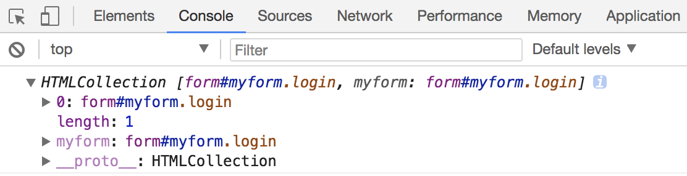
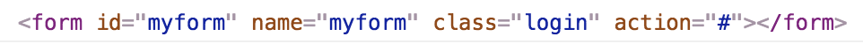
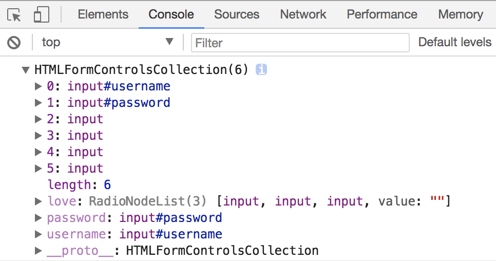
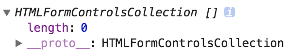

## 获取表单元素

获取表单元素的方式，大体可以分为以下几种方式:

- Document 对象提供的定位页面元素的一系列方法
- Document 对象提供了 forms 属性
- Document 对象通过表单的 name 属性值获取指定表单元素

接下来，我们将分别介绍这几种方式的使用。

### 定位页面元素的方法

Document 对象提供了如下几种定位页面元素的方法:

- getElementById() 方法
- getElementsByName() 方法
- getElementsByTagName() 方法
- getElementsByClassName() 方法
- querySelector() 方法
- querySelectorAll() 方法

> 以上几种方法的具体使用，请参考第二章节的《定位页面元素》一节内容。

上述几种方法的使用，我们可以通过如下示例代码进行学习:

```html
<form id="myform" name="myform" class="login" action="#"></form>
<script>
    var formId = document.getElementById('myform');
    var formName = document.getElementsByName('myform');
    var formElement = document.getElementsByTagName('form')[0];
    var formClass = document.getElementsByClassName('login')[0];
    
    var formId2 = document.querySelector('#myform');
    var formElement2 = document.querySelectorAll('form')[0];
</script>
```

### Document 对象的 forms 属性

Document 对象提供了 forms 属性，用于获取当前 HTML 页面中所有表单的集合。例如如下示例代码:

```html
<form id="myform" name="myform" class="login" action="#"></form>
<script>
    var forms = document.forms;
</script>
```

该属性返回 HTMLCollection 对象，该对象封装了当前 HTML 页面中的所有表单对象。例如如下示例代码:

```html
<form id="myform" name="myform" class="login" action="#"></form>
<script>
    var forms = document.forms;
    console.log(forms);
</script>
```

上述示例代码打印了通过 `document.forms` 得到的结果，结果如下图所示:



我们知道 HTMLCollection 对象是一个类数组对象，所以可以通过索引值的方式得到我们想要的表单。例如如下示例代码:

```html
<form id="myform" name="myform" class="login" action="#"></form>
<script>
    var forms = document.forms;
    console.log(forms[0]);
</script>
```

上述示例代码得到了 HTMLCollection 集合中的第一个表单对象，结果如下图所示:



如果在定义表单元素时，定义了 name 属性的话，我们还可以通过表单元素的 name 属性得到我们想要的表单。例如如下示例代码:

```html
<form id="myform" name="myform" class="login" action="#"></form>
<script>
    var forms = document.forms;
    console.log(forms['myform']);
</script>
```

> **说明:** 上述示例代码中的 "myform" 表示表单的 name 属性值。

上述示例代码同样得到了 HTMLCollection 集合中的第一个表单对象，结果如下图所示:


### 表单的 name 属性值方式

较早的浏览器还会将定义了 name 属性的表单保存在 document 对象中。这样，我们就可以通过如下方式来访问指定的表单:

```javascript
document.表单名
```

我们可以通过如下示例代码进行学习:

```html
<form id="myform" name="myform" class="login" action="#"></form>
<script>
    var form = document.myform;
    console.log(form);
</script>
```

上述示例代码也可以得到我们想要的表单元素。

> **注意:** 这种方式并不推荐，因为在新版本的浏览器中可能不再支持。

## 获取表单组件

获取表单组件的方式，大体可以分为以下几种方式:

- Document 对象提供的定位页面元素的一系列方法
- HTMLFormElement 对象的 elements 属性

接下来，我们将分别介绍这几种方式的使用。

### 定位页面元素的方法

Document 对象提供了如下几种定位页面元素的方法:

- getElementById() 方法
- getElementsByName() 方法
- getElementsByTagName() 方法
- getElementsByClassName() 方法
- querySelector() 方法
- querySelectorAll() 方法

> 以上几种方法的具体使用，请参考第二章节的《定位页面元素》一节内容。

上述几种方法的使用，我们可以通过如下示例代码进行学习:

```html
<form id="myform" name="myform" class="login" action="#">
    用户名: <input type="text" id="username" name="username"><br>
    密码: <input type="password" id="password" name="password"><br>
    爱好:
    <input type="checkbox" name="love" value="html">html
    <input type="checkbox" name="love" value="css">css
    <input type="checkbox" name="love" value="javascript">javascript
    <br>
    <input type="submit">
</form>
<script>
    var username = document.getElementById('username');
    var loves = document.getElementsByName('love');
</script>
```

### HTMLFormElement 对象的 elements 属性

HTMLFormElement 对象提供了 elements 属性，用于获取指定表单的所有组件的集合。例如如下示例代码:

```html
<form id="myform" name="myform" class="login" action="#">
    用户名: <input type="text" id="username" name="username"><br>
    密码: <input type="password" id="password" name="password"><br>
    爱好:
    <input type="checkbox" name="love" value="html">html
    <input type="checkbox" name="love" value="css">css
    <input type="checkbox" name="love" value="javascript">javascript
    <br>
    <input type="submit">
</form>
<script>
    var myform = document.forms[0];
    var formElements = myform.elements;
    console.log(formElements);
</script>
```

该属性返回 HTMLFormControlsCollection 对象（如果是 HTML4 的话: 则是 HTMLCollection 对象）。

上述示例代码的输出结果，如下图所示:



> **注意:** HTMLFormElement 对象提供了 elements 属性获取的表单组件中，不包含 type 为 image 的 input 元素。

例如如下示例代码:

```html
<form id="myform" name="myform" action="#">
    <input type="image" src="imgs/longestory.png">
</form>
<script>
    var myform = document.forms[1];
    var formElements = myform.elements;
    console.log(formElements);
</script>
```

上述示例代码输出的结果，如下图所示:



上述结果表示 HTMLFormElement 对象的 elements 属性得到的集合中，并没有得到 type 为 image 的 input 元素。

## 表单序列化

表单序列化是在 Ajax 出现之后流行起来的。原因也很简单，因为 Ajax 等异步提交技术无法使用表单默认的提交行为。如果每个表单组件一一获取又比较麻烦，所以才出现了表单序列化。

> **说明:** 上述内容只是作者个人的理解。

### 什么是表单序列化

所谓的表单序列化，就是模拟表单元素默认的提交行为来获取表单组件的数据内容。所以，我们要想掌握表单序列化的话，必须要先了解表单在提交时是如何获取数据的。

接下来，我们通过一个小案例来了解表单在提交时时如何获取数据的:

```html
<form id="myform" name="myform" class="login" action="#">
    用户名: <input type="text" id="username" name="username"><br>
    密码: <input type="password" id="password" name="password"><br>
    爱好:
    <input type="checkbox" name="love" value="html">html
    <input type="checkbox" name="love" value="css">css
    <input type="checkbox" name="love" value="javascript">javascript
    <br>
    <input type="submit" id="submit">
</form>
```

上述示例代码是一个普通的表单，其中包含了文本框、密码框和多选框。当然，需要具有一个提交按钮才可以。

我们运行这个 HTML 页面，在浏览器的地址栏中可以看到如下结果:

```
http://localhost/example.html?username=longestory&password=longestory&love=html&love=javascript
```

上述结果中，"?"符号之后的内容就是表单提交之后，得到表单组件中的数据内容。

通过上述测试结果，我们可以总结出以下表单提交时获取表单组件的结论:

- 获取表单组件的 name 属性值和用户输入的数据，格式为 "name=value"
- 多个表单组件之间使用了 "&" 符号进行连接
- 只获取了被选中的多选框、单选框或下拉列表

### 实现表单序列化

根据上述的测试所得到的结论，我们就可以模拟表单在提交时获取表单组件的数据方式进行表单序列化。例如如下示例代码:

```javascript
function serialize(form) {
    // 参数验证
    if(!form && form.nodeName.toUpperCase() != "FORM" ){
        throw new Error("invalid parameters");
    }
    
    var encode = window.encodeURIComponent,
        slice = Array.prototype.slice;

    var params = [],
        i = 0,
        fields = slice.call(form.elements),
        len = fields.length,
        el,
        type;

    for(;i < len; i++){
        el = fields[i];
        type = el.type.toLowerCase();
        switch(type){
            case  "undefined":
            case  "button":
            case  "submit":
            case  "reset":
            case "file":
                break;
            case "select-one":
            case "select-multiple":
                if(el.name.length){
                    var j = 0, 
                        opts = slice.call(el.options),
                        oLen = opts.length,
                        selected = [] , // 用于合并参数
                        opt;            
                    for(; j < oLen; j++){
                        opt = opts[j];
                        if(!opt.selected)continue;
                        selected.push(opt.value);
                    }
                    params.push(encode(el.name) + "=" + encode(selected.join(",")));
                }
                break;
            case "checkbox":
            case "radio":
                if(!el.checked){
                    break;
                }   
            default:
                if(el.name.length){
                    params.push(encode(el.name) + "=" + encode(el.value));
                }
        }
    }
    return params.join("&");
}
```

> **注意:** 以上代码在 IE8 会报错，原因是 option 元素的实现并非一个 JavaScript 对象，导致无法使用 slice。

上述示例代码就是自定义实现表单序列化的一个函数。当然，这种实现方式并不唯一。而且，目前很多第三方的 JS 库也实现了此功能。

> **说明:** 上述实现表单序列化的代码来源于 [zhangguixu的博文](https://segmentfault.com/a/1190000006714445)