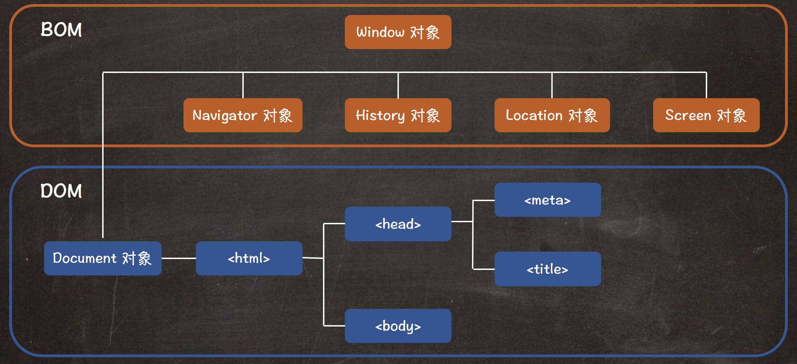

BOM 的全称为 Browser Object Model，被译为浏览器对象模型。

BOM 提供了独立于 HTML 页面内容，而与浏览器相关的一系列对象。主要被用于管理浏览器窗口及与浏览器窗口之间通信等功能。

BOM 由一系列对象构成，这些对象可以简单理解为是由各个浏览器所提供的，例如 Window 对象等。

> **值得注意的是:** BOM 是 JavaScript 中唯一一个没有标准的。

## BOM 关系图

 

