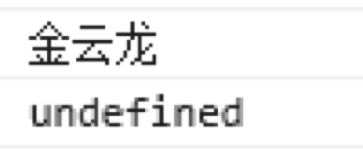
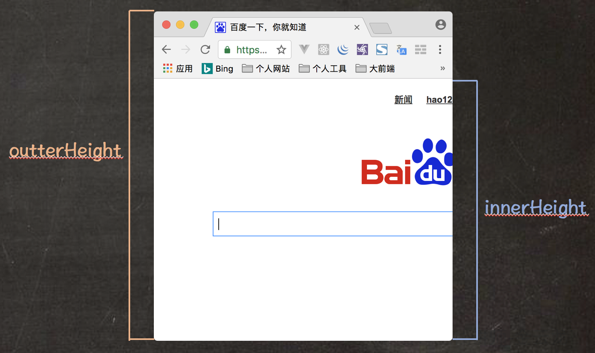

BOM 中最核心的对象就是 Window 对象，该对象表示运行 HTML 页面的浏览器窗口。

在浏览器环境中，Window 对象具有双重角色。该对象既是允许 JavaScript 逻辑访问浏览器窗口的一个对象，又是 ECMAScript 规范中的 Global 全局对象。

这就说明了，我们在浏览器环境中运行 JavaScript 逻辑时，在全局作用域中定义的对象、变量和函数都是 Window 对象的属性和方法。

我们也可以通过 Window 对象访问 Global 全局对象的属性和方法。例如 NaN、undefined 和 parseInt() 方法等。

## 全局作用域

在浏览器环境中，由于 ECMAScript 规范中 Window 对象代表了 Global 全局对象，因此所有定义在全局作用域中的变量和函数，都可以通过 Window 对象的属性和方法方式访问。

```javascript
var name = '全栈讲师';
function fn(){
	console.log('EASYDOM系列教程');
}
// 全局变量和全局函数方式访问
console.log(name);
fn();
// Window 对象的属性和方法方式访问
console.log(window.name);
window.fn();
```

> **值得注意的是:** 定义全局变量和定义 Window 对象的属性，在操作时还是有差别的:
> 
> - 如果是全局变量的话，不能使用 delete 运算符进行删除。
> - 如果是 Window 对象的属性的话，允许使用 delete 运算符进行删除。

```javascript
var name = '金云龙';
window.job = '全栈讲师';
// 使用 delete 运算符进行删除
delete window.name;
delete window.job;
// 删除之后调用测试结果
console.log(window.name);
console.log(window.job);
```

上述示例代码的执行结果如下:



## Window 对象的属性

Window 对象的属性数量较多，包含了浏览器窗口的基本信息、也包含了一些复杂的信息。我们可以人为将 Window 对象分为以下三类:

1. BOM 中其他对象，例如 Navigator 对象等。
2. 一些有关浏览器窗口的基本信息等，这些属性多属于 DOM 0 级别，并不是 W3C 标准规范。
3. 包含了大量有关 HTML 5 版本新增的功能等。

### 浏览器窗口的宽度和高度

Window 对象提供的属性中可以获取当前浏览器窗口的宽度和高度，具有两组:

- innerWidth 和 innerHeight 属性:

	只读属性，返回当前浏览器窗口的可视宽度和高度。如果存在滚动条，也包含滚动条。

- outterWidth 和 outterHeight 属性:

	只读属性，返回当前浏览器窗口的整个宽度和高度。



### Window 对象与 self 属性

Window 对象的 self 属性返回当前浏览器窗口的只读属性。换句话讲，self 属性返回的是 Window 对象的引用。

我们可以通过以下方式来测试 self 属性:

```javascript
console.log(window == window.self);
```

我们也可以通过以下代码判断当前浏览器是否是最顶层窗口:

```javascript
if (window.top != window.self) {
	console.log("这个窗口不是最顶层窗口");
}else{
	console.log("这个窗口是最顶层窗口");
}
```

## Window 对象的方法

Window 对象的方法，我们主要从以下几方面进行学习:

1. 系统提示框：alert() 方法、confirm() 方法和 prompt() 方法
2. 打开与关闭窗口：open() 与 close() 方法、 showModalDialog()
3. DOM 规范标准 0 级别的一些方法
4. 定时器：setTimeout() 与 clearTimeout() 、setInterval() 与 clearInterval()

> **值得注意的是:** Window 对象的方法不止以上四种，还包含 HTML 5 版本新增方法和一些已经废弃的方法等。

### 系统提示框

- 提示框方法

```javascript
alert('这是一个提示框');
```

- 确认框方法

```javascript
var result = confirm('这是一个确认框');
```

- 输入框方法

```javascript
var result = prompt('这是一个标准输入框','这是默认提示内容');
```

