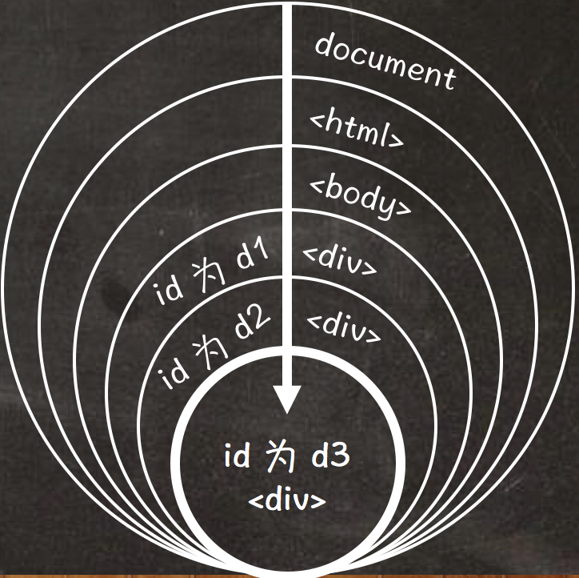
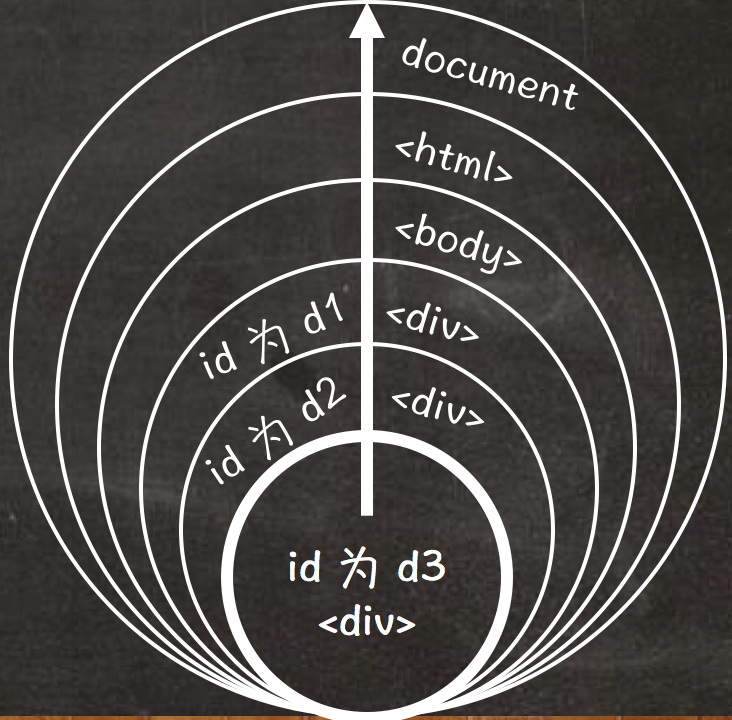

## 什么是事件流

所谓事件流，就是当触发某个元素的事件时，事件会按照 DOM 树结构进行传播，传播的过程分为捕获阶段、目标阶段和冒泡阶段三个阶段。

- 捕获阶段：该阶段是由网景公司提出的。按照 DOM 树结构由 document 对象向下的顺序传播，直到目标元素为止。
- 目标阶段：该阶段就是指目标元素触发当前事件。
- 冒泡阶段：该阶段是由微软公司提出的，按照 DOM 树结构由目标元素向上的顺序传播，直到 document 对象为止。

## 事件监听器

事件监听器 addEventListener() 方法的第三个参数的作用，就是设置当前注册的事件是捕获阶段还是冒泡阶段。

```javascript
element.addEventListener(eventName, functionName, capture)
```

上述语法结构中，参数的具体说明如下:

| 参数名称 | 描述 |
| --- | --- |
| eventName | 为元素指定具体的事件名称（例如单击事件是 click 等）|
| functionName | 注册事件的句柄 |
| capture | 设置事件是捕获阶段还是冒泡阶段。false 为默认值，表示冒泡阶段 |

## 捕获阶段

如果将事件监听器方法 addEventListener() 的第三个参数的只设置为 true，即为捕获阶段。

如下代码示例，使用事件监听器方法同时为三个 <div> 元素注册相同事件:

```html
<div id="d1">
	<div id="d2">
		<div id="d3"></div>
	</div>
</div>
```

> **值得注意的是:** IE 8 及之前版本的浏览器不支持捕获阶段。

我们可以通过以下示意图更好地理解事件的捕获阶段:



## 冒泡阶段

如果将事件监听器方法 addEventListener() 的第三个参数的只设置为 false，即为冒泡阶段。

如下代码示例，使用事件监听器方法同时为三个 <div> 元素注册相同事件:

```html
<div id="d1">
	<div id="d2">
		<div id="d3"></div>
	</div>
</div>
```

我们可以通过以下示意图更好地理解事件的冒泡阶段:



## 取消事件冒泡

当元素注册事件设置为冒泡阶段时，可以通过 Event 事件对象的 stopPropagation() 方法取消事件冒泡。

```html
<div id="d1">
	<div id="d2">
		<div id="d3"></div>
	</div>
</div>
<script>
	var d1 = document.getElementById('d1');
	d1.addEventListener('click',function(){
		alert(this.id);
	},false);
	var d2 = document.getElementById('d2');
	d2.addEventListener('click',function(){
		alert(this.id);
	},false);
	var d3 = document.getElementById('d3');
	d3.addEventListener('click',function(event){
		alert(this.id);
		event = event || window.event;
		event.stopPropagation();
	},false);
</script>
```
