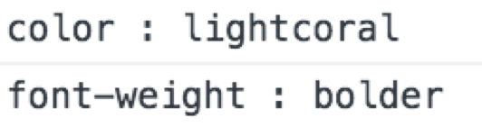
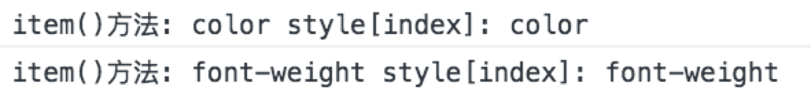
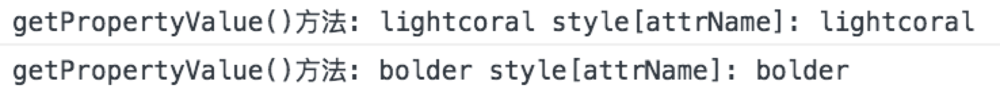

## 回顾什么是内联样式

所谓内联样式，就是通过 HTML 页面元素的 style 属性为当前元素定义 CSS 样式。

以下代码示例，就是通过 style 属性定义 CSS 内联样式:

```html
<p style="color: lightcoral;font-weight: bolder">这是一个段落内容.</p>
```

> **值得注意的是:**
> 
> - HTML 页面的结构与样式并没有有效分离
> - 定义的 CSS 样式只针对当前元素有效

## 获取内联样式

由于设置内联样式的方式是利用 HTML 页面元素的 style 属性实现的，所以获取内联样式主要是依靠 DOM 中获取属性方式实现。

- Element 对象的 getAttribute() 方法获取 style 属性的值。
- 通过 DOM 对象 HTMLElement 的 style 属性获取。

### Element 对象的 getAttribute() 方法

Element 对象的 getAttribute() 方法的语法结构如下:

```javascript
var value = element.getAttribute('style');
```

以上语法结构中调用 getAttribute() 方法的 element 表示 HTML 页面元素，传递的参数 style 表示属性名称，而返回值则是指定属性名对应的值（内联样式的声明内容）。

我们可以通过以下示例代码，学习如何通过 getAttribute() 方法获取内联样式:

```html
<p id="p1" style="color: lightcoral;font-weight: bolder">这是一个段落内容.</p>
<script>
    var pElem = document.getElementById('p1');
    var style = pElem.getAttribute('style');
    console.log(style);
</script>
```

上述示例代码的输出结果如下:


### DOM 对象的 style 属性

由于 DOM 规范标准中将 Document 对象定位的 HTML 页面元素解析为相应的对象，而这些对象都继承于 HTMLElement 对象。该对象提供了 style 属性，返回 CSSStyleDeclaration 对象。

我们可以通过以下示例代码，学习如何通过 HTMLElement 对象的 style 属性获取内联样式:

```html
<p id="p1" style="color: lightcoral;font-weight: bolder">这是一个段落内容.</p>
<script>
    var pElem = document.getElementById('p1');
    var style = pElem.style;
    console.log(style);
</script>
```

上述示例代码，通过 style 属性会得到 CSSStyleDeclaration 对象，该对象表示一个 CSS 属性键值对的集合。

## CSSStyleDeclaration 对象

通过 element.style 返回的是 CSSStyleDeclaration 对象。CSSStyleDeclaration 对象表示一个CSS属性键值对的集合。

CSSStyleDeclaration 对象提供的属性和方法可以帮助我们获取 CSS 样式的具体内容。

| 属性或方法 | 描述 |
| --- | --- |
| cssText | 声明块的文本内容。|
| length | 属性的数量。|
| item() | 返回属性名。 例如: nameString= styleObj.item(0) Alternative: nameString= styleObj[0]|
| getPropertyValue() | 返回属性值。例如: valString= styleObj.getPropertyValue('color')|

### cssText 属性

通过 element.style.cssText 属性获取 CSS 声明块的文本内容。

我们可以通过以下示例代码，学习如何通过 cssText 属性获取 CSS 声明块的文本内容:

```html
<p id="p1" style="color: lightcoral;font-weight: bolder">这是一个段落内容.</p>
<script>
    var pElem = document.getElementById('p1');

    var styleDeclar = pElem.style;
    var cssText = styleDeclar.cssText;
    console.log(cssText);
</script>
```

上述示例代码的输出结果如下:


> **值得注意的是:** cssText 属性返回的是 CSS 声明块的文本内容，解析操作时会比较麻烦。

### 遍历 CSSStyleDeclaration 对象

由于 CSSStyleDeclaration 对象具有 length 属性，返回该对象的属性的数量。我们可以通过这一特性实现遍历 CSSStyleDeclaration 对象，从而得到所有属性名和相应的值。

我们可以通过以下示例代码，学习如何遍历 CSSStyleDeclaration 对象:

```html
<p id="p1" style="color: lightcoral;font-weight: bolder">这是一个段落内容.</p>
<script>
    var pElem = document.getElementById('p1');

    var styleDeclar = pElem.style;
    for ( var i=0; i<styleDeclar.length; i++ ){
        var propertyName = styleDeclar.item(i);
        var propertyValue = styleDeclar.getPropertyValue(propertyName);
        console.log(propertyName + ' : ' + propertyValue);
    }
</script>
```

上述示例代码的输出结果如下:



在上述示例代码中，我们利用 CSSStyleDeclaration 对象的 length 属性控制遍历过程。

在遍历过程中，我们先利用 CSSStyleDeclaration 对象的 item() 方法得到每一个 CSSStyleDeclaration 对象的属性名，再利用 CSSStyleDeclaration 对象的 getPropertyValue() 方法根据属性名得到相应的值。

### item() 方法

通过 element.style.item(index) 获取 CSS 的样式属性名，这种方式也可以通过 element.style[index] 方式进行替换。换句话讲，这两种方式是等价的。

我们可以通过以下示例代码，学习对比这两种方式:

```javascript
for ( var i=0; i<styleDeclar.length; i++ ){
    var itemName = styleDeclar.item(i);
    var styleName = pElem.style[i];
    console.log('item()方法: ' + itemName, 'style[index]: ' + styleName);
}
```

上述示例代码的输出结果如下:



### getPropertyValue() 方法

通过 element.style.item.getPropertyValue() 获取 CSS 的样式属性值，这种方式也可以通过 element.style[propertyName] 方式进行替换。

我们可以通过以下示例代码，学习对比这两种方式:

```javascript
for ( var i=0; i<styleDeclar.length; i++ ){
    var propertyName = styleDeclar.item(i);
    var value1 = styleDeclar.getPropertyValue(propertyName);
    var value2 = pElem.style[propertyName];
    console.log('getPropertyValue()方法: ' + value1, 'style[attrName]: ' + value2);
}
```

上述示例代码的输出结果如下:



### 属性链方式操作

由于通过 element.style 返回的是 CSSStyleDeclaration 对象，所以我们也可以通过 element.style.attrName 的方式获取具体的样式属性的值。

我们可以通过以下示例代码，学习这种获取方式:

```html
<p id="p1" style="color: lightcoral;font-weight: bolder">这是一个段落内容.</p>
<script>
    var pElem = document.getElementById('p1');
    var style = pElem.style;
    console.log(style.color);
</script>
```